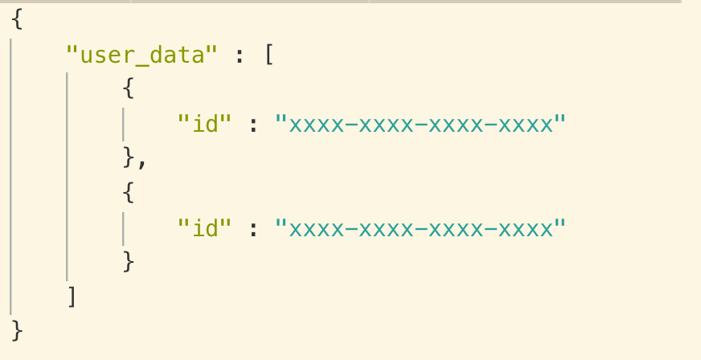

footer: 🦊
slidenumbers: true

# CodableでカオスなJSONに対応していく

### Otemachi.swift \#02 noppe (@noppefoxwolf)

---

#[fit] noppe

🏢 ディー・エヌ・エー
💻 ライブ配信iOSアプリ
🦊 きつねかわいい
📖 Otemachi.swift初参戦!


---

# スタンダードなJSON



---

# Codableでマッピング

```swift
struct UserData {
  let id: String
}

let decoder = JSONDecoder()
let userData = try decoder.decode(Response.self, data: data)
```

^ 非常に簡単です

---

# 世の中にはカオスなJSONがある🤯

今日は２つ紹介

---

# 事例1

---

# このJSON何がおかしいですか


^ user_dataとno-moreの２つのキーがあるんですけど、
^ snake_caseとkebab-caseが混合しています


---

# snake_caseとkebab-caseが混合している！ 


---

# snake_case以外が混ざっているとKeyDecodingStrategyが使えない…

---

# KeyDecodingStrategyとは？

Swift 4.1 〜
JSONキー名->プロパティ名のルールを指定する事で、`CodingKey`や`init(from decoder:)`を実装せずにマッピング出来る

^ 通常であれば、jsonのキー名とプロパティ名が異なる場合はCodingKeyや`init(from decoder:)`を使ってマッピングする必要があります。
^ ただ、Swift4.1からはdecoderのKeyDecodingStrategyを指定することで、キー名を自動的に解釈してくれる機能があります

---

# KeyDecodingStrategyとは？

```swift
let decoder = JSONDecoder()
decoder.keyDecodingStrategy = .convertFromSnakeCase
let obj = try decoder.decode(Response.self, from: data)
```

^ 例えばconvertFromSnakeCaseは、スネークケースのキー名をキャメルケースに変換してマッピングするルールです。
^ ただ、snakeCaseでないものがあるとtryで弾かれる
^ では、さきほどのような混合しているjsonはinit(from:decoder)を実装しなきゃいけないのか？

---

# 大丈夫

---

# カスタムデコードルール

```swift
decoder.keyDecodingStrategy = .custom { keys in
    let lastComponent = keys.last!.stringValue.camelCase
    return AnyKey(stringValue: String(lastComponent))!
}
```

カスタムなkeyDecodingStrategyを作る事ができる。

^ 仕組みは簡単で
^ マッピングするフィールドまでの経路が含まれたcodingKeysを受け取って、プロパティ名のCodingKeyを返す実装をするだけです。
^ キーをキャメルのプロパティ名に変換して返すだけです

---

# snake_case or kebab-case to camelCase

```swift
extension String {
  internal var camelCase: String {
    return self.replacingOccurrences(of: "-", with: "_")
               .components(separatedBy: "_")
               .enumerated()
               .map { 0 == $0 ? $1 : $1.capitalized }
               .joined()
    
  }
}
```

^ 受け取ったキー名をキャメルに変換するのはこんな感じです。
^ 一旦割愛します。興味がある人はスライドアップしたので読んでみてください。

---

# 事例２

---

# このJSON何がおかしいですか


^ これだけでは実はおかしくないです

---


^ しかし、他のオブジェクトの中はこのようになっていたらどうでしょうか。
^ attachmentの中身が配列のときと、オブジェクトが直に入っている場合です。
^ これとかはgithubのAPIとかでたまに見かけるやつです

---

# 型が不定


---

# 型が不定

- 一回Anyに詰めて、取り出す時に型を付けてあげる
- 存在しうるすべてのフィールドを持ったオブジェクトにマッピングする
- Dictionaryで持つ

^ これはいくつか方法があって
^ とかになると思います。
^ 今回は一番上の方法を紹介します。

---

# 型が不定

```swift
struct AttachmentObject: Decodable {
  let value: Any
  
  init(from decoder: Decoder) throws {
    let container = try decoder.singleValueContainer()
    if let value = try? container.decode(Media.self) {
      self.value = value
    } else if let value = try? container.decode([Media].self) {
      self.value = value
    } else {
      preconditionFailure()
    }
  }
}
```

^ Anyに直接詰めてもいいのですが、そうするとAnyプロパティを持つクラスで他のプロパティも含む`init(from:decoder)`実装しないといけないのでラップしたクラスを実装します。
^ 中でデコードしうる型にデコードできるか繰り返し試しているだけです。

---

# 型が不定

使うときはswitchなどで分岐

```swift
switch object.data.value {
case let value as Media:
  print(value.id)
case let value as [Media]:
  print(value.compactMap({ $0.id }))
default: break
}
```

---

# 🤔

なんか他に良い方法がある気がするので、知っている人がいたら教えてください

---

# そもそも

なんでこんなjsonパースしてるの？？

---

# gab.ai


APIクライアントライブラリを作ってます

^ 海外のTwitterみたいなSNSがあって、そこのAPIクライアントライブラリを作ってます
^ gabの話とか興味ある人

---

# noppefoxwolf/GabKit

今回のテクニックで実装してます🤯

gabまだまだ日本人少ないので、興味ある人は使ってみてください〜〜

---

# Cironnup - チヌロップ


gab.comのiOSネイティブアプリ。審査中

^ 出たら使ってみてください。AsyncDisplayKitとかで実装してます

---

# ありがとうございました🦊