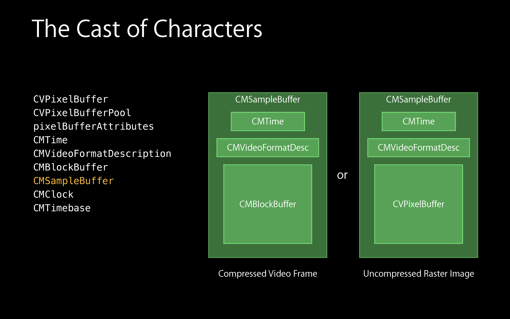

footer: 🦊
slidenumbers: true

# CVBufferの話
## ROPPONGI.swift 第6回 望年会

---

#[fit] noppe

💻 Pococha iOSエンジニア
🦊 きつねかわいい
🌲 ROPPONGI.swift初参戦
📱 iOSDCで描画周りの話をしましたv


---


^ Discord Swiftで動いてるSwiftbotをチーム内でも使ってみたくてSwift製のSlackBot作ったりしてました。


---

[.autoscale: true]

# 動画を扱う機会の増加

- 動画配信アプリやhevcの登場、CoreVideoに触れる機会が増えている
- データやメディアを扱うBuffer系クラスの利用頻度は増加
- みんな、気持ちでCVPixelBufferを使っていませんか？

---

# Buffer系クラスの近況

- 古いクラスなので、ほぼ変更はない

- しかし環境は変化、クライアントでのデコードやOpenGLESやMetalへのデータ渡しに利用される

^ ただでさえも難しいことが多いのでCVBuffer周りなんとなくこういうものなのかって思って貰えれば
^ ということで今日は話しようかなと思いました。

---

# CVBuffer

---

# CVBuffer

- CVBufferのCVはCoreVideoのCV

データバッファを直接触らずに簡単に読み書きするためのIF

---


---

# 代表的なCVBufferの派生

- CVImageBuffer
- CVPixelBuffer
- CVOpenGLESTexture

---

# CVBufferじゃない方

- CMSampleBuffer
`これは違う`
- CMBlockBuffer
`これも違う`

^ この違いはあとで開設します。

---

# どんな時に取得できるものか

ciImage.pixelBuffer //10_0~

とか

let ib = CMSampleBufferGetImageBuffer(sb)

^ AVCaptureOutputから取れるsbから取り出したりします。

---

[.autoscale: true]

# CVBufferの正体

- CVImageBuffer
`public typealias CVImageBuffer = CVBuffer`
- CVPixelBuffer
`public typealias CVPixelBuffer = CVImageBuffer`
- CVOpenGLESTexture
`public typealias CVOpenGLESTexture = CVImageBuffer`


---

# CVPixelBuffer vs CVImageBuffer

- Q: typealiasなんだし同じでしょ？
- A: 俺にもわからん

---

# CVPixelBuffer vs CVImageBuffer

- **CVPixelBuffer**

メモリ内のピクセルバッファにアクセスするためのクラス

- **CVImageBuffer**

メモリ内の画像にアクセスするためのクラス

^ それ違うの？取得出来るものを見れば分かってきそう。

---

ピクセル情報アクセスの例

- 縦横のサイズ
- データサイズ

画像アクセスの例

- カラースペース

---

# ドキュメント

> **CVImageBufferGetDisplaySize(_:)**

A CGSize structure defining the nominal display size of the buffer Returns zero size **if called with a non-CVImageBufferRef type or NULL**.

^ CVImageBufferじゃなかったらnil返すと書いてある

---

# 検証

```swift
var pb: CVPixelBuffer? = nil
CVPixelBufferCreate(kCFAllocatorDefault, 
                    128, 128,
                    kCVPixelFormatType_32BGRA, nil, &pb)
CVImageBufferGetDisplaySize(pb!)

// -> (128.0, 128.0)
```

---

[.autoscale: true]

# 動画を扱う機会の増加

- 動画配信アプリやhevcの登場、CoreVideoに触れる機会が増えている
- データやメディアを扱うBuffer系クラスの利用頻度は増加
- ~~みんな、気持ちでCVPixelBufferを使っていませんか？~~

---

# 気持ちで使っている

^ 忘れましょう、教えてください

---

# UIImageとの違い


^ ここでこの図を思い出したい
^ これってUIImageと同じ？広義の意味では同じ

---

[.autoscale: true]

# UIImageとの違い

- CVBuffer
アドレスを参照しているだけなので、ロックはするがコピーやキャッシュはされない
中間レンダリングも勝手にされない
**ビデオのように高速に処理する必要がある箇所に最適**

^ CoreVideoだし

---

# アドレスのロック

CVBufferのデータバッファに**CPU**からアクセスする場合はアドレスをロックする必要がある

```
CVPixelBufferLockBaseAddress(pb, .readOnly)
defer { CVPixelBufferUnlockBaseAddress(pb, .readOnly) }
```

^ 0 or CVPixelBufferLockFlags.readOnly(= 1)
^ GPUからアクセスする場合は不要です（やるとパフォーマンス落ちる）

<!-- GPUからのアクセスの場合はロック不要
おそらくCVOpenGLESTextureの事を指している

GPU/CPUのメモリが共有になったけど？ロック必要なの？
必要ないならOpenGL同様deplicatedになっていそう。
そもそもメモリアドレスなのでMetalのShared Memoryではない機構でアクセスしているのでは
仮にMetalの機構だったとしてもMetal非対応の環境下では内部的にOpenGLが使われる処理もあるため
OpenGLESの場合は共有されていない。

//http://dsas.blog.klab.org/archives/52168462.html -->

---

# CVPixelBufferの中身を表示する

^ 開発時はXcodeのbreak pointでquick look出来る
^ デバッグの際に必要なので見てみる

---

# 一番簡単な方法

CVPixelBuffer -> CIImage -> UIImage

`CIImage(cvPixelBuffer: CVPixelBuffer)`

`UIImage(ciImage: ciImage)`

---

# Metalで表示する

`CVMetalTextureCache`経由で

CVPixelBuffer -> MTLTexture

MTKViewなどで表示

^ シミュレータターゲットだと出てこない

---

# OpenGLESで表示する

`CVOpenGLESTextureCache`経由で

CVPixelBuffer -> OpenGLESTexture

GLKViewなどで表示

---

# CMSampleBufferとは

^ さっき見たアレ

---



^ 名前は似ているが、構造は別物

---

# CMSampleBufferとは

・必ずしもCVPixelBufferが入っているとは限らない

^ BlockBufferはオーディオやデコード前のバッファ

---

# 話そうと思っていた話題

・CVPixelBufferからCMSampleBufferを作る話
・ユースケース
・利点

BlockBufferはデコード前の映像フレームやオーディオが含まれる

---
