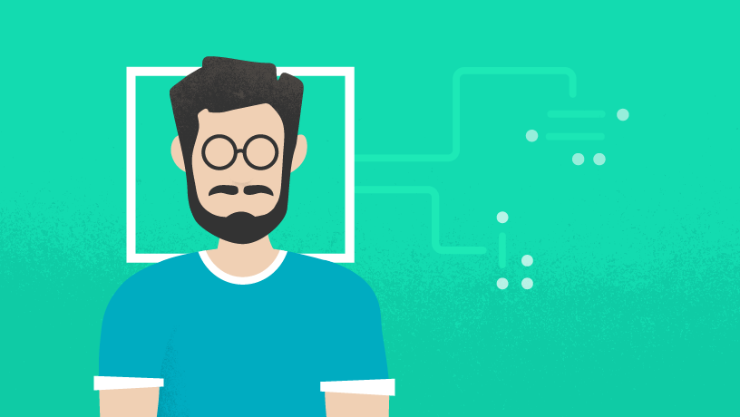
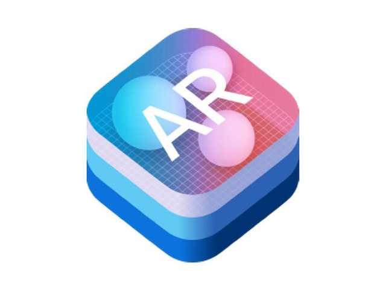
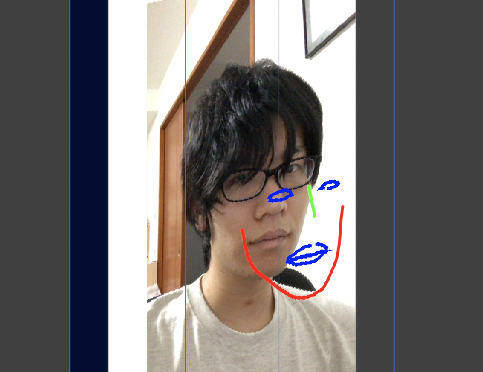
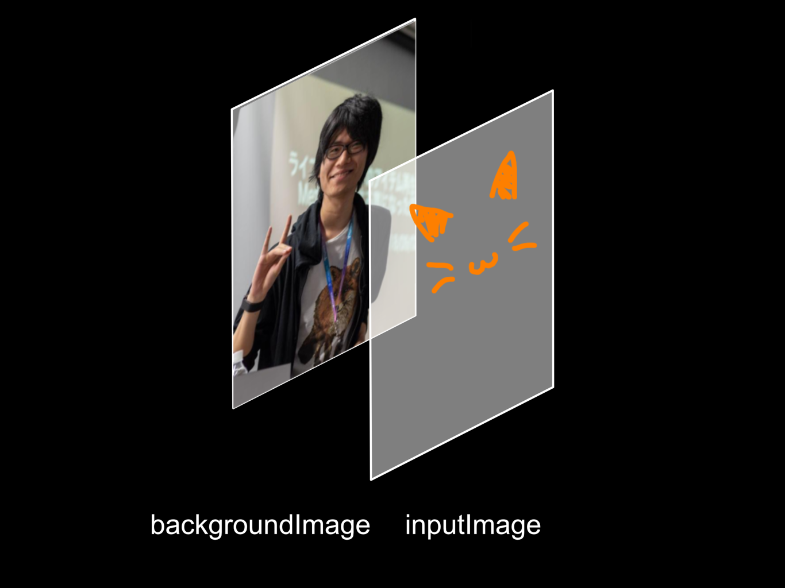
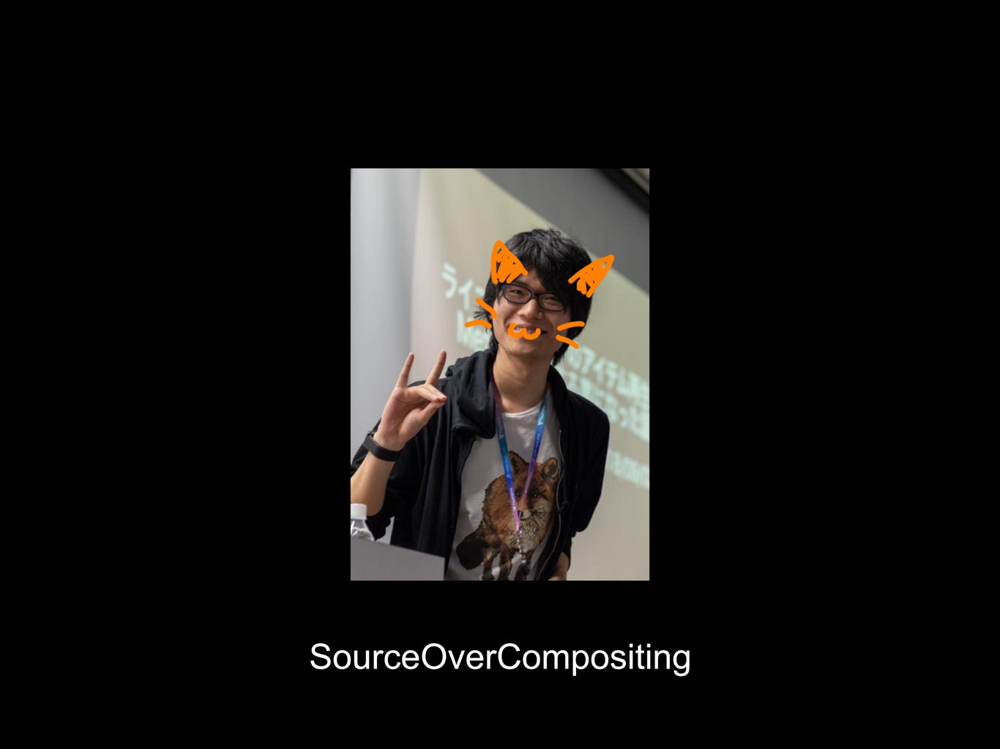
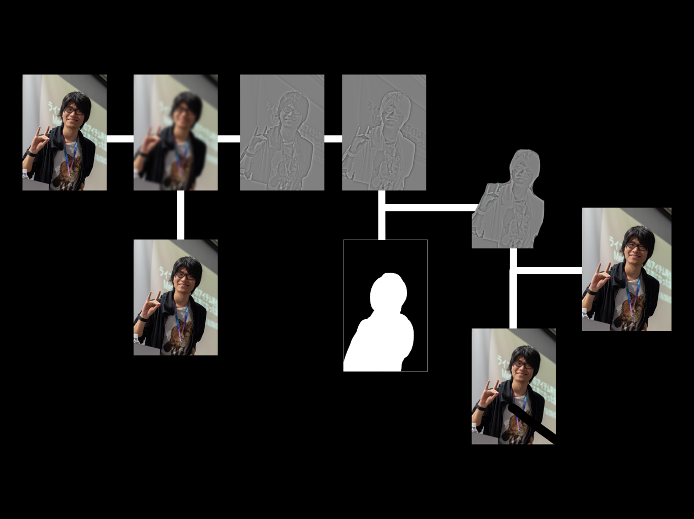
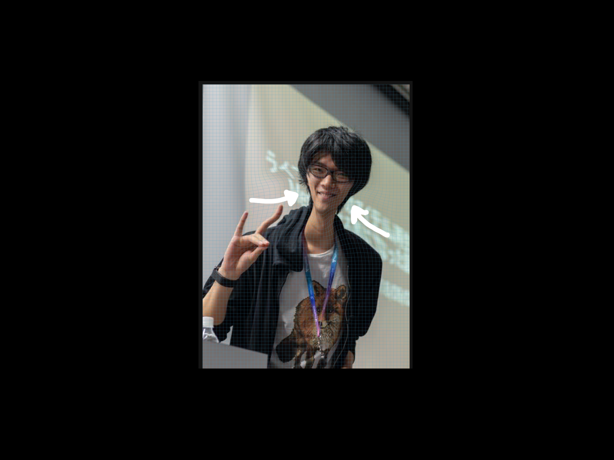
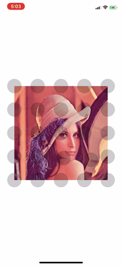

slidenumbers: true
autoscale: true

# ソーシャルライブサービスにおけるデジタル化粧の仕組みと実装

## noppe at DeNA

[.footer: iOSDC 2019/09/07 13:30~ Track A 30min.]

---

# noppe

- DeNA inc
- **Pococha**
- 💖🦊
- Github: noppefoxwolf


^ 今回は難しい計算とかは出てきません

---


---

# Pococha

- **ソーシャルライブサービス**
- アイテムによる動画演出 ( iOSDC 2018 )
- デジタル化粧による映像補正　←　今日の話

^ 生放送を通してコミュニケーションをする

---

# デジタル化粧

^ さて、デジタル化粧とはなんでしょうか

---

# デジタル化粧

- 映像を加工する事でリアルタイムに補正をかける技術

- 主にセルフィーアプリや、ライブアプリで採用されることが多い


^ デジタル化粧という言葉に明確な定義がないので本トークでは、「映像を加工する事でリアルタイムに補正をかける技術」と定義します。
^ セルフィーアプリや、ライブアプリで採用されることが多いので見たことがある方も多いのでは無いでしょうか？

---

# デジタル化粧の利点

- 実際にメイクせずに撮影を開始することができる

- メイクのかかり具合を調整できる

- 現実では出来ないメイクが出来る

^ 実際にメイクせずに撮影を開始することができるので、利用までのハードルが低い
^ デジタル化粧にはどんな利点があるでしょうか
^ では、具体的にどのような機能が世の中にはあるでしょうか？

---

# デジタル化粧の機能種別

- コスプレ
- メイク
- 整形

^ 今日は大きく３つに分けてみました。
^ そして、今日はこの３つの実装方法を紹介します。
^ それぞれの実装をしていく前に共通する技術の選定をします。

---

# 実装に必要な技術

- 顔認識
- シェーディング

^ これらは、顔認識とシェーダーによる処理によって実現できます。
^ そこで、まずはiOSにおける顔認識をどのように行うかを決めましょう。

---

# 顔認識技術の選定

・ CIDetector　・Vision
・ ARKit　・MLKit ・SenseME ...etc

^ iOSでは、標準でいくつかの顔認識をすることができるフレームワークがあります。
^ また、サードパーティのライブラリも存在します。
^ 今回調査したフレームワークを比較してみましょう。

---

# CIDetector

- iOS 5.0+
- 10fps (iPhoneX)
- 鼻や目の位置は取れるが輪郭は取れない

^ 笑っているか

---

# Vision.framework

- iOS 11.0+
- 10fps (iPhone X)
- 特徴点 72 points
- 各部位の輪郭と位置が取れる

^ つまり、口なら口の位置だけで無く唇の輪郭も取ることもできます。

---

# MLKit

- Firebase
- 無料
- 15fps (iPhone X)　若干遅延があり
- 特徴点 132 points
- 各部位の輪郭と位置が取れる



^ https://firebase.google.com/docs/ml-kit/detect-faces?hl=ja
^ https://firebase.google.com/docs/ml-kit/face-detection-concepts

---

# SenseME

- SenseTime Group Ltd
- **Pocochaで利用中**
- 有料
- 60fps
- 特徴点 106 points
- メイクや整形なども出来る全部乗せ


^ https://dena.com/jp/press/004432
^ 類似のSDKもあるので、興味がある人はask the speakerで

---

# ARKit

- iOS11+ (True depth camera)
- 60fps
- 1220 points
- 三次元空間の特徴点しか取れない

^ 口とか鼻の位置は分からない。シミュレータで使えない



---


---

# 比較

|名称|価格|fps|landmark|
|---|---|---|---|
|CIDetector|**無料**|10|△|
|Vision|**無料**|10|⭕|
|MLKit|**無料**|15|⭕|
|SenseME|有料|**60**|⭕|
|ARKit|**無料**|**60**|×|

^ 全部どりというのは無いというのが現実
^ ここにさらに対応機種などの縛りを入れていくと中々難しくなるのですが、未来の話をしましょう。
^ 有料で良いならSenseMeなどのSDKを購入するのが手早い
^ ARKitも工夫すれば使うことができます。

---


^ 使いやすいようにするライブラリを作りました

---

# noppefoxwolf/AR2DFaceDetector



- ARKitで取得したジオメトリのスクリーン座標を提供
- ジオメトリの頂点から擬似landmarkを提供
- 60fps

^ どういうことかというと、先ほど解説した通りARKitは3次元空間での座標しかくれない
^ そこで、それらをスクリーン上のどの位置の点なのかをカメラやジオメトリから計算するライブラリ
^ というわけで顔認識に関しては今日はARKitを使っていきましょう。

---

# シェーディング

**CoreImage.framework**

Metal Shader Languageを使ってフィルタが書けるフレームワーク
CIFilter使えば重ねがけが楽
標準フィルタも充実している(200種類くらい)

^ 今回はなるべく標準フィルタ使いながら実装していく

---

# 早速実装をしていきましょう！

---

# 1.コスプレ

---

# コスプレ

- 衣装をオーバーレイする機能

- 今回は動物のスタンプを顔に表示してみましょう。

<!-- ビデオ -->

---

# 処理の過程

---



^ 映像と位置を調整したスタンプ画像を合成する

---


^ 先ほどのAR2DFaceDetectorを使って

---


---



^ 非常に簡単に実装できます

---

# 実装

[.code-highlight: all]
[.code-highlight: 6]

```swift
let inputStickerImage = CIImage()
let captureImage = frame.captureImage
let transformedStickerImage = inputStickerImage.transformed(by: transform)

//composited は SourceOverCompositing のメソッド版
transformedStickerImage.composited(over: inputImage)
```

^ 実装コードも非常に簡単です
^ 一部のフィルタはCIImageにも生えているので、こんな感じで繋いでも良いですね
^ compositedはSourceOverCompositingのメソッド版です

---

# 2.メイク

---

# メイク

- 肌質を滑らかにするフィルタを書いてみましょう
- Photoshopのチュートリアルを探すのがオススメ

^ https://www.creativebloq.com/tutorial/high-pass-skin-smoothing-photoshop-812591
^ https://retamame.com/high-pass-skin-retouch

---

# 処理の過程

- ハイパスフィルタを階調反転したものをオーバーレイでマスク合成する

^ 実際にやってみましょう

---

# 実演

---

色々登場人物が出てきました

・ハイパス
・階調反転
・オーバーレイ
・マスク合成

---

# ハイパスフィルタ

- 周波数分解して得られる画像

- 高周波を取り出すフィルタ


^ 画像の周波数というのは、近辺のピクセルとの色の違いを指します。

---


^ 右がハイパス画像ですが、輪郭が強調されているのは境目で色が大きく変わるからです。

---


^ ハイパスの逆に、高周波を除いたローパスというものも存在します。
^ 周波数分解した画像を合わせると元の画像になる性質があります。
^ つまり、図のようにオリジナル画像はローパスとハイパスの足し算で表現できるということです。
^ ハイパス画像を得たい時はこの逆で、オリジナルからローパスを引けばいいわけです

---

# ハイパスのMSL


[.code-highlight: all]
[.code-highlight: 2]

```cpp
float4 highpass(sample_t image, sample_t blurredImage) {
    float3 rgb = float3(image.rgb - blurredImage.rgb);
    return float4(rgb + 0.5, image.a);
}
```

^ この処理をMetal Shader languageで書いてみましょう。
^ 非常に簡単な式になります
^ 見た通りrgbをオリジナルからブラー分引くだけです。


---

# CIKernelとして読み込む

```swift
let url = Bundle.main.url(
    forResource: "default",
    withExtension: "metallib"
)

let data = try! Data(contentsOf: url)
let kernel = try! CIColorKernel(
    functionName: "highpass",
    fromMetalLibraryData: data
)
```

---


[.slidenumbers: false]
[.footer: [Image by Core Image Filter Reference](https://developer.apple.com/library/archive/documentation/GraphicsImaging/Reference/CoreImageFilterReference/index.html#//apple_ref/doc/filter/ci/CIOverlayBlendMode)]

# 階調反転

- 色と輝度を反転すること

- つまりはネガポジにすること


---

[.slidenumbers: false]
[.footer: [Image by Core Image Filter Reference](https://developer.apple.com/library/archive/documentation/GraphicsImaging/Reference/CoreImageFilterReference/index.html#//apple_ref/doc/filter/ci/CIOverlayBlendMode)]

# オーバーレイ

- 乗算とスクリーン合成を基本色で切り替える合成方法
- 明るく鮮やかになる


---

# マスク

[.slidenumbers: false]
[.footer: [Image by Core Image Filter Reference](https://developer.apple.com/library/archive/documentation/GraphicsImaging/Reference/CoreImageFilterReference/index.html#//apple_ref/doc/filter/ci/CIOverlayBlendMode)]

- 白黒のマスク画像を使い、黒い部分を描画しないようにして合成


---

# 実装

ハイパス: 自作
反転：CIColorInvert
オーバーレイ：CIOverlayBlendMode
マスク画像：ARFrame.segmentationBuffer
マスク合成：CIBlendWithMask

^ iOS13

---



---


---

# noppefoxwolf/SkinSmoothingFilter

- 反転ハイパスによる化粧フィルタをCIFilterで提供
- 60fps

---

# 3.整形

---

# 整形

- 目を大きくしたり、頰を細くしたり

- 今回は頬を細くするフィルタを作る

---

# 処理の過程

- 顔認識で輪郭を取得
- 頬の周辺のピクセル**だけ**を引き寄せる



^ 歪ませることをWarpやDistortionというCIFilterは無い
^ 自作してたけど、結構難しい

---

# SKWarpGeometry

- **SpriteKit**
- iOS 10.0+
- グリッドの移動前・移動後を指定することで、グリッド周辺を歪ませる


^ なんとか使えないかなと思って、使えるようにしました

^ https://developer.apple.com/videos/play/wwdc2016/610/?time=1718

---


---

# noppefoxwolf/WarpGeometryFilter

- WarpGeometryをCIFIlterとして提供
- 内部的にSpriteKitでオフスクリーンレンダリング
- Metal経由でレンダリング結果をCIImageとして提供



---

[.code-highlight: all]
[.code-highlight: 1-6]
[.code-highlight: 7-12]
[.code-highlight: 13-18]

```swift
let sourcePositions: [SIMD2<Float>] = [
  .init(0.00, 0.00), .init(0.10, 0.00), .init(0.90, 0.00), .init(1.00, 0.00),
  .init(0.00, 0.25), .init(0.10, 0.25), .init(0.90, 0.25), .init(1.00, 0.25),
  .init(0.00, 0.55), .init(0.10, 0.55), .init(0.90, 0.55), .init(1.00, 0.55),
  .init(0.00, 1.00), .init(0.10, 1.00), .init(0.90, 1.00), .init(1.00, 1.00),
]
let destinationPositions: [SIMD2<Float>] = [
  .init(0.00, 0.00), .init(0.10, 0.00), .init(0.90, 0.00), .init(1.00, 0.00),
  .init(0.00, 0.25), .init(0.13, 0.25), .init(0.87, 0.25), .init(1.00, 0.25),
  .init(0.00, 0.55), .init(0.10, 0.55), .init(0.90, 0.55), .init(1.00, 0.55),
  .init(0.00, 1.00), .init(0.10, 1.00), .init(0.90, 1.00), .init(1.00, 1.00),
]
let warpGeometry = SKWarpGeometryGrid(columns: 3, rows: 3,
                                      sourcePositions: sourcePositions,
                                      destinationPositions: destinationPositions)
warpGeometryFilter.setValue(perspectiveCorrectionOutput, forKey: kCIInputImageKey)
warpGeometryFilter.setValue(warpGeometry, forKey: kCIInputWarpGeometryKey)
warpGeometryOutput = warpGeometryFilter.outputImage!
```

---


^ これを使って整形するわけですが、顔の角度とかを考え始めると大変なので一回顔を切り抜きます。
^ ここの座標はAR2DFaceDetectorが提供しているので渡すだけです。

---

# 実演

---

# noppefoxwolf/iOSDC19-Example

- 今日のデモで使ったもの

---

# まとめ

- 特殊な知識が無くても、デジタル化粧は作れるようになってきた
- 3つのOSSを公開しました


---

# プロダクトへの応用難易度

ソーシャルライブにおけるデジタル化粧は、自然さや外れないことも重要
その瞬間に映像は配信されるので求められる品質は非常に高い

---

