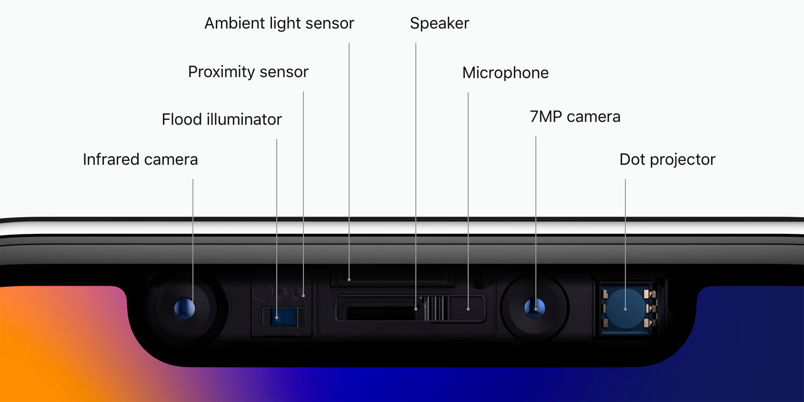
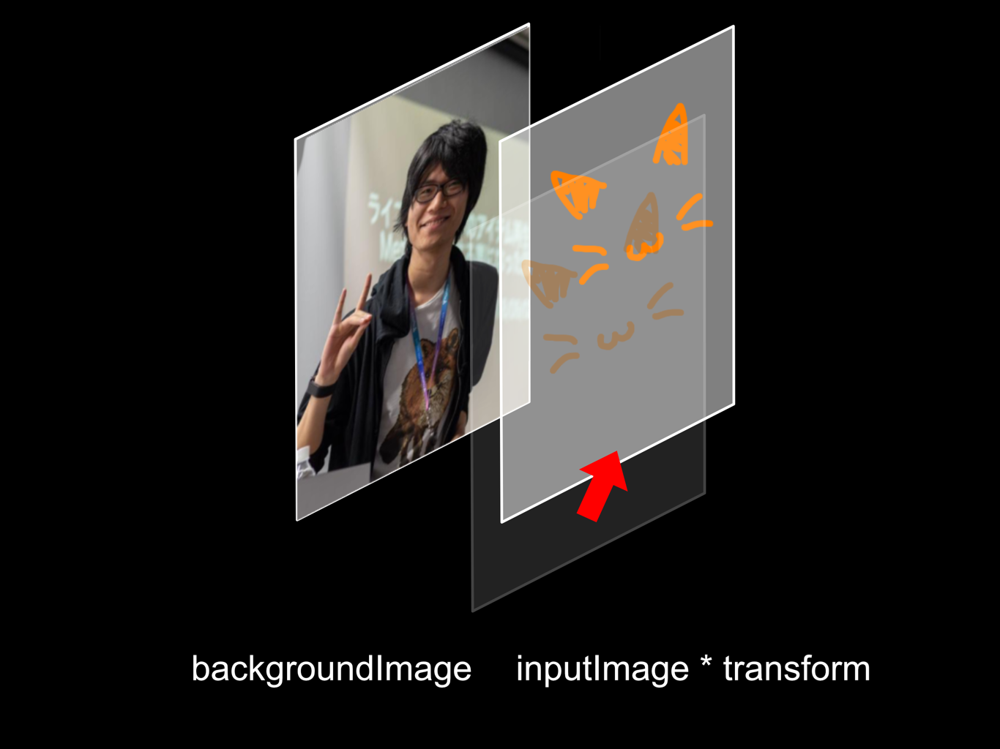
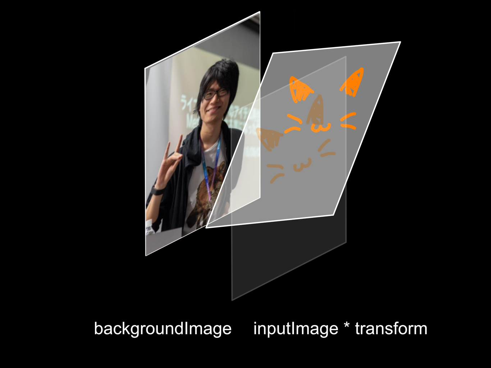
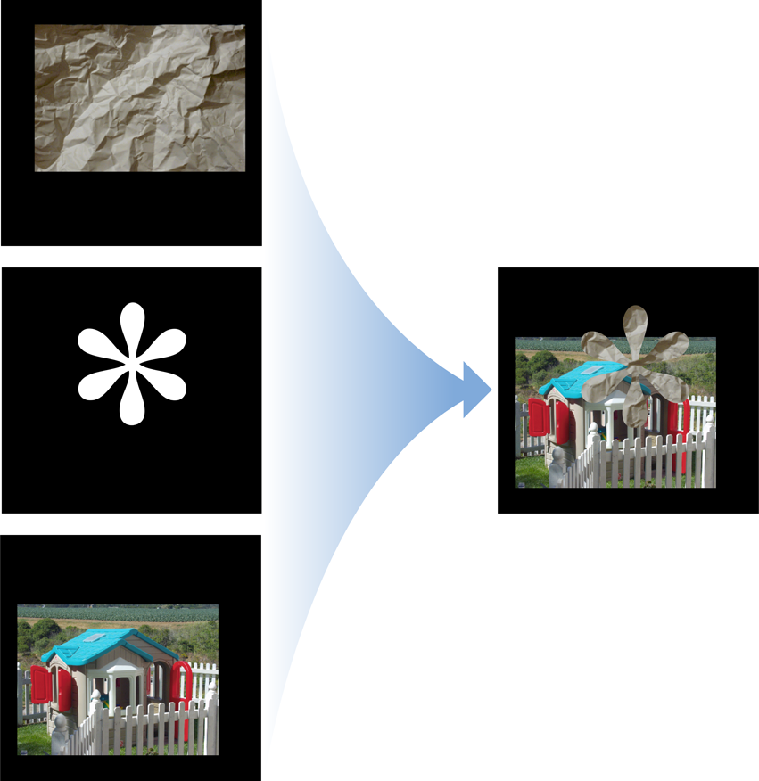

slidenumbers: true
autoscale: true

# ソーシャルライブサービスにおけるデジタル化粧の仕組みと実装

## noppe at DeNA

[.footer: iOSDC 2019/09/07 13:30~ Track A 30min.]

---

# noppe

- DeNA inc
- **Pococha**
- 💖🦊
- Github: noppefoxwolf


---


---

# Pococha

- **ソーシャルライブサービス**
- アイテムによる動画演出 ( iOSDC 2018 )
- デジタル化粧による映像補正　←　今日の話

^ 生放送を通してコミュニケーションをする

---

# デジタル化粧

^ さて、デジタル化粧とはなんでしょうか

---

# デジタル化粧

- 映像を加工する事でリアルタイムに補正をかける技術

- 主にセルフィーアプリや、ライブアプリで採用されることが多い


^ デジタル化粧という言葉に明確な定義がないので本トークでは、「映像を加工する事でリアルタイムに補正をかける技術」と定義します。
^ セルフィーアプリや、ライブアプリで採用されることが多いので見たことがある方も多いのでは無いでしょうか？

---

# デジタル化粧の利点

- 実際にメイクせずに撮影を開始することができる

- メイクのかかり具合を調整できる

- 現実では出来ないメイクが出来る

^ デジタル化粧にはどんな利点があるでしょうか
^ では、具体的にどのような機能が世の中にはあるでしょうか？

---

# デジタル化粧の機能種別

- コスプレ
- メイク
- 整形

^ 今日は大きく３つに分けてみました。
^ そして、今日はこの３つの実装方法を紹介します。
^ それぞれの実装をしていく前に共通する技術の選定をします。

---

# 実装に必要な技術

- 顔認識
- シェーディング

^ これらは、顔認識とシェーダーによる処理によって実現できます。
^ そこで、まずはiOSにおける顔認識をどのように行うかを決めましょう。

---

# 顔認識技術の選定

・ CIDetector　・Vision
・ ARKit　・MLKit ・SenseMe ...etc

^ iOSでは、標準でいくつかの顔認識をすることができるフレームワークがあります。
^ また、サードパーティのライブラリも存在します。
^ 今回調査したフレームワークを比較してみましょう。

---

# CIDetector

- iOS 5.0+
- 10fps (iPhoneX)
- 鼻や目の位置は取れるが輪郭は取れない

---

# Vision.framework

- iOS 11.0+
- 10fps (iPhone X)
- 各部位の輪郭と位置が取れる

---

# MLKit

- Firebase
- 無料
- 15fps (iPhone X)
- 132 points
- 各部位の輪郭と位置が取れる

^ https://firebase.google.com/docs/ml-kit/detect-faces?hl=ja
^ https://firebase.google.com/docs/ml-kit/face-detection-concepts

---

# SenseMe

- SenseTime Group Ltd
- 有料
- **Pocochaで利用中**
- 60fps
- 106 point
- **美白や整形なども出来る全部乗せ**

^ https://dena.com/jp/press/004432

---

# ARKit

- iOS11+ (Require True depth camera)
- 60fps
- 1220 points
- 三次元空間の特徴点しか取れない

^ シミュレータで使えない

---



---

# 比較

|名称|価格|fps|landmark|
|---|---|---|---|
|CIDetector|**無料**|10|△|
|Vision|**無料**|10|⭕|
|MLKit|**無料**|15|⭕|
|SenseMe|有料|**60**|⭕|
|ARKit|**無料**|**60**|×|

---


^ 使いやすいようにするライブラリを作りました

---

# noppefoxwolf/AR2DFaceDetector

- ジオメトリの二次元座標を提供
- ジオメトリの頂点から擬似landmarkを提供

---

# シェーディング

**CoreImage.framework**

Metal Shader Languageを使ってフィルタが書けるフレームワーク
標準フィルタも充実している

---

# 早速実装をしていきましょう！

---

# 1.コスプレ

---

# コスプレ

- スタンプ画像をオーバーレイする機能

<!-- ビデオ -->

---


^ 映像と位置を調整したスタンプ画像を合成する

---



---



---


---

# 実装

[.code-highlight: 2, 3, 4-5]

```
let stickerImage = CIImage()
let captureImage = frame.captureImage

let filter = CIFilter.sourceOverCompositing()
filter.inputImage = stickerImage
filter.backgroundImage = captureImage
let outputImage = filter.outputImage
```

---

# 2.メイク

---

# メイク

- 肌質を良くするフィルタを書いてみましょう
- Photoshopのチュートリアルを探すのがオススメ

^ https://www.creativebloq.com/tutorial/high-pass-skin-smoothing-photoshop-812591
^ https://retamame.com/high-pass-skin-retouch

---

# 処理の過程

- ハイパスフィルタを階調反転したものをオーバーレイでマスク合成する

^ 実際にやってみましょう

---

# 実演

---

# 解説

---

色々登場人物が出てきました

・ハイパス
・階調反転
・オーバーレイ
・マスク合成

---

# ハイパスフィルタ

- 周波数分解して得られる画像

- 高周波を取り出すフィルタ


---


---


---


[.slidenumbers: false]
[.footer: [Image by Core Image Filter Reference](https://developer.apple.com/library/archive/documentation/GraphicsImaging/Reference/CoreImageFilterReference/index.html#//apple_ref/doc/filter/ci/CIOverlayBlendMode)]

# 階調反転

- 色と輝度を反転すること

- つまりはネガポジにすること


---

[.slidenumbers: false]
[.footer: [Image by Core Image Filter Reference](https://developer.apple.com/library/archive/documentation/GraphicsImaging/Reference/CoreImageFilterReference/index.html#//apple_ref/doc/filter/ci/CIOverlayBlendMode)]

# オーバーレイ

- 乗算とスクリーン合成を基本色で切り替える合成方法
- 明るく鮮やかになる


---

# マスク

[.slidenumbers: false]
[.footer: [Image by Core Image Filter Reference](https://developer.apple.com/library/archive/documentation/GraphicsImaging/Reference/CoreImageFilterReference/index.html#//apple_ref/doc/filter/ci/CIOverlayBlendMode)]

- 白黒のマスク画像を使い、黒い部分を描画しないようにして合成



---

# 実装

ハイパス: 自作
反転：CIColorInvert
オーバーレイ：CIOverlayBlendMode
マスク画像：ARFrame.segmentationBuffer
マスク合成：CIBlendWithMask

^ iOS13

---


---


---

# noppefoxwolf/SkinSmoothingFilter

- 反転ハイパスをCIFilterで提供

---

# 3.整形

---

# 整形

- 目を大きくしたり、頰を細くしたり

- 今回は頬を細くするフィルタを作る

---

# 解説

- 頬の周辺のピクセルだけを引き寄せれば良い
- …がCIFilterにはない
- 自分で計算して実装するのも結構大変…

---

# SKWarpGeometryGrid

- SpriteKit
- iOS 10.0+
- グリッドの移動前・移動後を指定することで、グリッド周辺を歪ませる

---

# SpriteKit...

---


---

# noppefoxwolf/WarpGeometryFilter

- WarpGeometryをCIFIlterとして提供
- 内部的にSpriteKitをオフスクリーンレンダリング
- Metal経由でレンダリング結果をCIImageとして提供
- 60fps

---

# 実装

- 顔周辺を切り取り CIPerspectiveCorrection
- 歪ませる WarpGeometryFilter
- 元に戻す CIPerspectiveTransform

---

# まとめ

- 特殊な知識が無くても、デジタル化粧は作れるようになってきた！
- 3つのOSSを公開しました

---

# プロダクトへの応用難易度

ソーシャルライブにおけるデジタル化粧は、自然さや外れないことも重要
その瞬間に映像は配信されるので求められる品質は非常に高い

---

