slidenumbers: true
autoscale: true

---

# 確認用スライド

- iPad接続
- iPadスクリーンに出るか
- iPadの通信OFF(Bluetoothはオン)
- 明るさ
- 端切れしないか

---

# 確認用スライド２

test


---


# 確認用スライド３

test


---

# ソーシャルライブサービスにおけるデジタル化粧の仕組みと実装

## noppe at DeNA

[.footer: iOSDC 2019/09/07 13:30~ Track A 30min.]

---

# noppe

- @noppefoxwolf
- DeNA inc
- **Pococha**
- 💖🦊


^ 今回は難しい計算とかは出てきません

---


---

# Pococha

- **ソーシャルライブサービス**
- Metalを使った動画演出実装
  ↑　iOSDC 2018
- デジタル化粧による映像補正
  ↑　今日の話


^ 生放送を通してコミュニケーションをする

---

# デジタル化粧

^ さて、デジタル化粧とはなんでしょうか

---

# デジタル化粧

- 映像を加工する事でリアルタイムに補正をかける技術

- 主にセルフィーアプリや、ライブアプリで採用されることが多い

- PocochaではSenseME®を利用


^ デジタル化粧という言葉に明確な定義がないので本トークでは、「映像を加工する事でリアルタイムに補正をかける技術」と定義します。
^ セルフィーアプリや、ライブアプリで採用されることが多いので見たことがある方も多いのでは無いでしょうか？
^ 右側に出ているのはPocochaのフィルタ調整画面です。
^ 極端にならないようにしているのでよくみてください
^ そもそもPocochaはどうしているかというと、SenseMEというSDKを利用しています。

---

# SenseME®

- SenseTime Group Ltd
- **Pocochaで利用中**
- 有料


^ SenseMEについてはDeNAとSenseTime社の業務提携の記事があるので詳細はそちらをご覧ください。

[.slidenumbers: false]
[.footer: [DeNAとSenseTimeが業務提携 | 株式会社ディー・エヌ・エー【DeNA】](https://dena.com/jp/press/004432)]

---

# デジタル化粧の利点

- 実際にメイクせずに撮影を開始することができる

- メイクのかかり具合を調整できる

- 現実では出来ないメイクが出来る

^ デジタル化粧にはどんな利点があるでしょうか
^ 実際にメイクせずに撮影を開始することができるので、利用までのハードルが低い
^ また、Undo/Redoや細かな調整ができる
^ では、具体的にどのような機能が世の中にはあるでしょうか？

---

# デジタル化粧の機能種別

^ では、具体的にどのような機能が世の中にはあるでしょうか？

---


^ 今日は大きく３つに分けてみました。
^ 他にもありますが。
^ コスプレは、顔にステッカーを貼ったりして仮装する機能
^ メイクは、顔のトーンやシミなどを消す機能
^ 整形は、輪郭などを補正する機能です
^ そして、今日はこの３つの実装方法を紹介します。
^ それぞれの実装をしていく前に共通する技術の選定をします。

---

# デジタル化粧に必要な基礎技術

- 顔の位置推定
- シェーディング
- センス

^ これらは、顔検出とシェーダーによる処理によって実現できます。
^ そこで、まずはiOSにおける顔検出をどのように行うかを決めましょう。

---

# 顔検出技術の選定

・CIDetector
・Vision.framework
・ARKit
・MLKit
・others ...

^ iOSでは、標準でいくつかの顔検出をすることができるフレームワークがあります。
^ また、サードパーティのライブラリも存在します。
^ 今回調査したフレームワークを比較してみましょう。

---

# CIDetector

- iOS 5.0+
- 10fps (iPhoneX)
- 簡単な鼻や目の位置は取れるが輪郭は取れない


^ 笑っているか

---

# Vision.framework

- iOS 11.0+
- 10fps (iPhone X)
- 特徴点 65, 76 points
- 各部位の輪郭と位置が取れる


^ つまり、口なら口の位置だけで無く唇の輪郭も取ることもできます。

---

# MLKit

- Firebase
- 無料
- 15fps (iPhone X)
- 特徴点 132 points
- 各部位の輪郭と位置が取れる

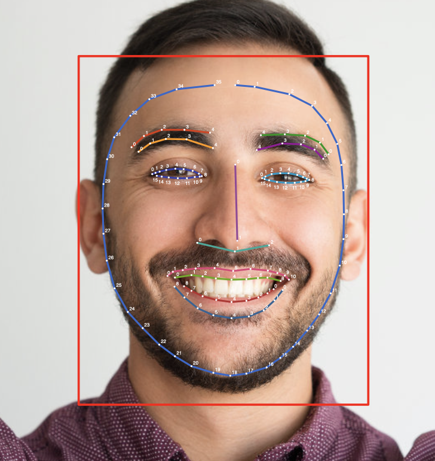

^ 若干遅延があり

---

# ARKit

- iOS11+ (True depth camera)
- 60fps
- 1220 points
- 三次元空間の特徴点しか取れない
- **輪郭や位置は取れない**


^ ３次元空間の特徴点だけなので、画面上のどこかは取れない
^ 口とか鼻の位置は分からない。シミュレータで使えない

---


---

# 比較

|名称|fps|landmark|対応機種|
|---|---|---|---|---|
|CIDetector|10|△|◎|
|Vision|10|⭕|○|
|MLKit|15|⭕|○|
|ARKit|**60**|×|△|

^ 処理時間が短いほどライブなどのリアルタイム処理に向いています
^ 全部どりというのは無いというのが現実
^ ここにさらに対応機種などの縛りを入れていくと中々難しくなるのですが、未来の話をしましょう。
^ 有料で良いならSenseMeなどのSDKを購入するのが手早い
^ ARKitも工夫すれば使うことができます。

---


^ 使いやすいようにするライブラリを作りました

---

# noppefoxwolf/AR2DFaceDetector


- ARKitで取得したジオメトリのスクリーン座標を提供
- ジオメトリの頂点から擬似landmarkを提供
- 60fps

^ どういうことかというと、先ほど解説した通りARKitは3次元空間での座標しかくれない
^ そこで、それらをスクリーン上のどの位置の点なのかをカメラやジオメトリから計算するライブラリ
^ というわけで顔検出に関しては今日はARKitを使っていきましょう。

---

# シェーディング

---

# シェーディング

- CoreImage
- MetalKit
- GLKit
- GPUImage
- MetalPetal

---

**CoreImage.framework**

- Metal Shader Languageを使ってフィルタが書ける
- 標準フレームワーク
- CIFilter使えば重ねがけが楽
- 標準フィルタも充実している(200種類くらい)

^ 今回はなるべく標準フィルタ使いながら実装していく

---

# 早速実装をしていきましょう！

---

# 1.コスプレ

---

# コスプレ

- 衣装をオーバーレイする機能

- 今回は動物のスタンプを顔に表示してみましょう。


---

# 処理の過程

---

# ARKitのカメラ映像を受け取る

```swift

extension ViewController: ARSessionDelegate {

  func session(_ session: ARSession, didUpdate frame: ARFrame) {

    let pixelBuffer: CVPixelBuffer =  frame.capturedImage

    let ciImage: CIImage = CIImage(cvPixelBuffer: pixelBuffer)

    // Do something

  }
  
}
```

^ ARSessionDelegateからCVPixelBufferを受け取ることができる

---

[.background-color: #000000]


^ 映像と位置を調整したスタンプ画像を合成する

---

[.background-color: #000000]


^ 先ほどのAR2DFaceDetectorを使って

---

[.background-color: #000000]


---

[.background-color: #000000]


^ 非常に簡単に実装できます

---

# 実装

[.code-highlight: all]
[.code-highlight: 7-8]

```swift
let inputStickerImage = CIImage(named: "sticker")
let captureImage = CIImage(cvPixelBuffer: frame.captureImage)

//transformed は CIAffineTransform のメソッド版
let transformedStickerImage = inputStickerImage.transformed(by: transform)

//composited は SourceOverCompositing のメソッド版
transformedStickerImage.composited(over: inputImage)
```

^ 実装コードも非常に簡単です
^ 一部のフィルタはCIImageにも生えているので、こんな感じで繋いでも良いですね
^ compositedはSourceOverCompositingのメソッド版です

---

# 2.メイク

---

# メイク

- 肌質を滑らかにするフィルタを書いてみましょう
- Photoshopのチュートリアルを探すのがオススメ

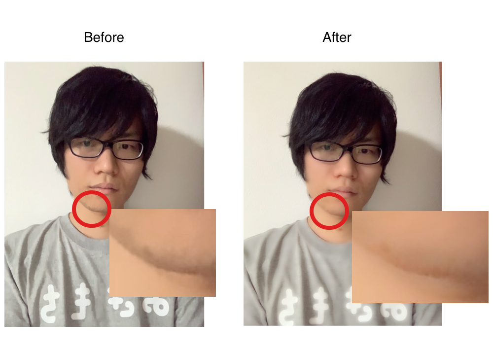

^ これ系の処理はPhotoshopのチュートリアルが参考になります。
^ https://www.creativebloq.com/tutorial/high-pass-skin-smoothing-photoshop-812591
^ https://retamame.com/high-pass-skin-retouch

---

# 処理の過程

- ハイパスフィルタを階調反転したものをオーバーレイでマスク合成する

^ 私が見つけたチュートリアル記事を要約するとこんな感じです
^ よく分からないですが、実際にやってみましょう

---

# 実演

---

色々登場人物が出てきました

・ハイパス
・階調反転
・オーバーレイ
・マスク合成

^ 簡単に解説します

---

# ハイパスフィルタ

- 周波数分解して得られる画像

- 高周波を取り出すフィルタ


^ 画像の周波数というのは、近辺のピクセルとの色の違いを指します。
^ ※詳しい話は次ページ

---


^ 例えば、白から黒は大きい、グレーが少し薄くなるなら小さい
^ 画像でも輪郭は大きく異なるので強調されている
^ 右がハイパス画像ですが、輪郭が強調されているのは境目で色が大きく変わるからです。

---


^ ハイパスの逆に、高周波を除いたローパスというものも存在します。
^ 周波数分解した画像を合わせると元の画像になる性質があります。
^ つまり、図のようにオリジナル画像はローパスとハイパスの足し算で表現できるということです。
^ ハイパス画像を得たい時はこの逆で、オリジナルからローパスを引けばいいわけです

---

# ハイパスのMSL


[.code-highlight: all]
[.code-highlight: 3]

```cpp
float4 highpass(sample_t image, sample_t blurredImage) {

    float3 rgb = float3(image.rgb - blurredImage.rgb);

    return float4(rgb + 0.5, image.a);

}
```

^ なぜこの解説をしたかというと、CIFilterにはハイパスフィルタは無いからです
^ なのでこの処理をMetal Shader languageで書いてみましょう。
^ 非常に簡単な式になります
^ 見た通りrgbをオリジナルからブラー分引くだけです。
^ ブラー画像はCIFilterで作ることができるので、自前で書く必要はありません

---

# CIKernelとして読み込む

```swift
let url = Bundle.main.url(
    forResource: "default",
    withExtension: "metallib"
)

let data = try! Data(contentsOf: url)
let kernel = try! CIColorKernel(
    functionName: "highpass",
    fromMetalLibraryData: data
)

kernel.apply(image ~~)
```

^ MSLでシェーダを書いたら、CIKernelとして読み込みます。
^ CIKernelはCIFilter同様に、画像を渡すと処理結果を吐くインターフェイスを持っています。
^ これでハイパスフィルタが出来上がりました

---


[.slidenumbers: false]
[.footer: [Image by Core Image Filter Reference](https://developer.apple.com/library/archive/documentation/GraphicsImaging/Reference/CoreImageFilterReference/index.html#//apple_ref/doc/filter/ci/CIOverlayBlendMode)]

# 階調反転

- 色と輝度を反転すること

- つまりはネガポジにすること

- CIColorInvert


---

[.slidenumbers: false]
[.footer: [Image by Core Image Filter Reference](https://developer.apple.com/library/archive/documentation/GraphicsImaging/Reference/CoreImageFilterReference/index.html#//apple_ref/doc/filter/ci/CIOverlayBlendMode)]

# オーバーレイ

- 乗算とスクリーン合成を基本色で切り替える合成方法
- 明るく鮮やかになる
- CIOverlayBlendMode

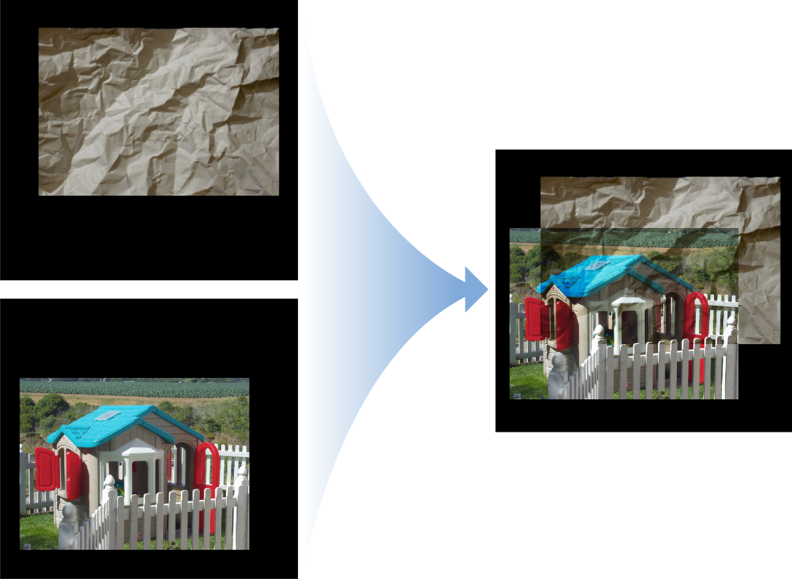

---

# マスク

[.slidenumbers: false]
[.footer: [Image by Core Image Filter Reference](https://developer.apple.com/library/archive/documentation/GraphicsImaging/Reference/CoreImageFilterReference/index.html#//apple_ref/doc/filter/ci/CIOverlayBlendMode)]

- 白黒のマスク画像を使い、黒い部分を描画しないようにして合成
- CIBlendWithMask


---

# マスク画像

- 綺麗にしたいところは白、そのままにしたいところは黒の画像

- 身体との境界ならARConfiguration.FrameSemanticsを使うと楽

- 肌の部分だけ抽出するには工夫が必要

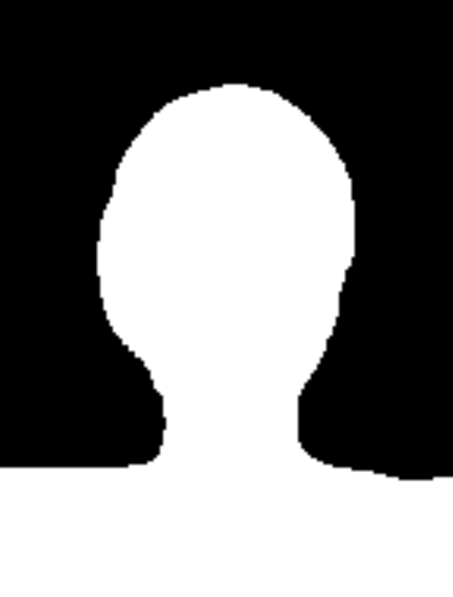

---

# 実装

ハイパス: CIColorKernel
反転：CIColorInvert
オーバーレイ：CIOverlayBlendMode
マスク画像：ARFrame.segmentationBuffer
マスク合成：CIBlendWithMask

^ iOS13

---

[.background-color: #000000]
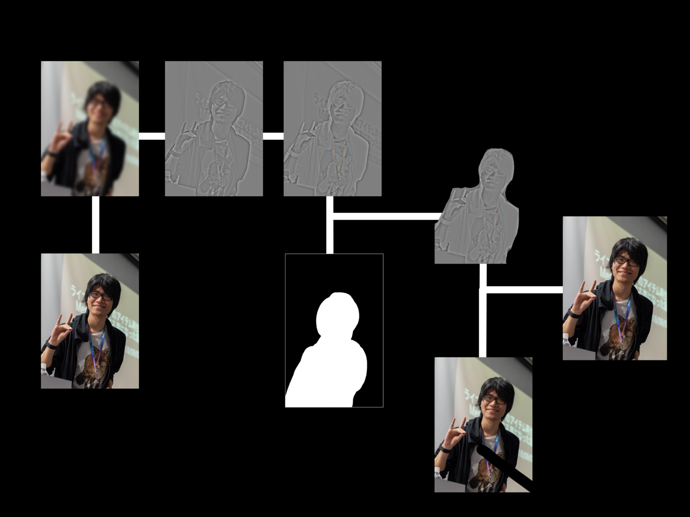

---

[.background-color: #000000]
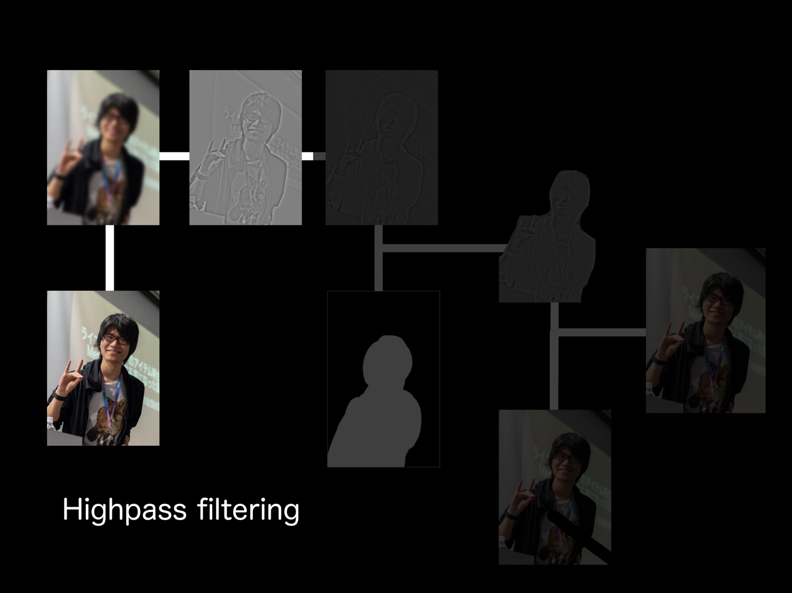

---

[.background-color: #000000]
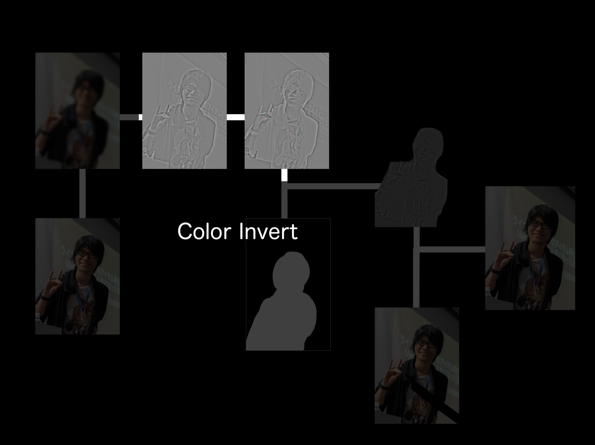

---

[.background-color: #000000]
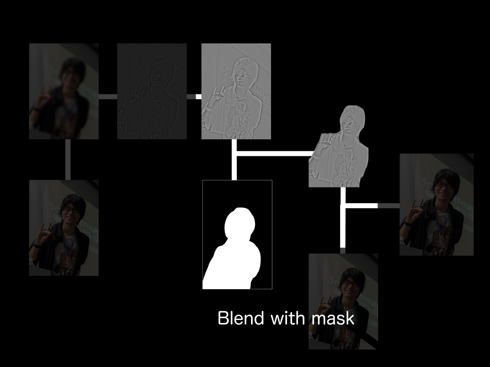

---

[.background-color: #000000]
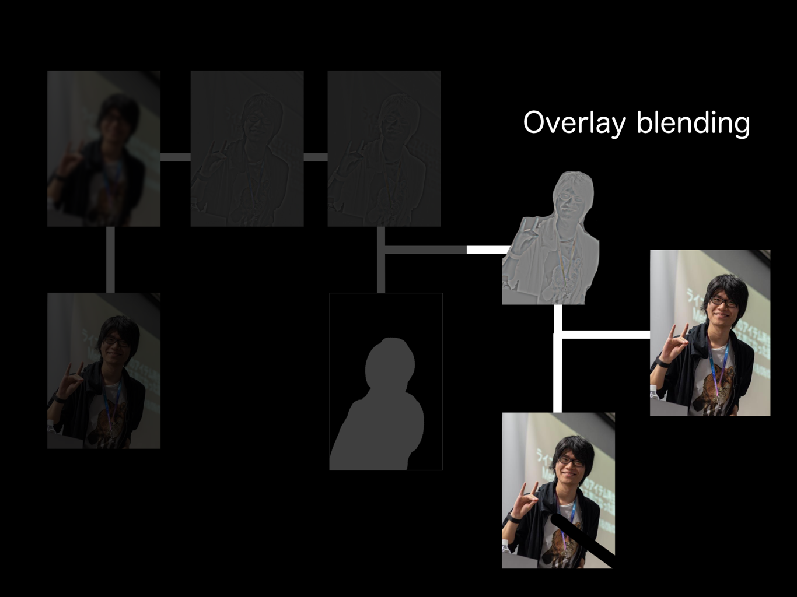

---


---

# noppefoxwolf/SkinSmoothingFilter

- 反転ハイパスによる化粧フィルタをCIFilterで提供
- 60fps
- CIFilter互換

---

# noppefoxwolf/SkinSmoothingFilter

```swift
let filter = SkinSmoothingFilter()

filter.setValue(inputImage, forKey: kCIInputImageKey)

filter.setValue(maskImage, forKey: kCIInputMaskImageKey)

filter.setValue(10.0, forKey: kCIInputAmountKey)

self.imageView.image = UIImage(ciImage: filter.outputImage)
```

---

# 3.整形

---

# 整形

- 目を大きくしたり、頰を細くしたり

- 今回は頬を細くするフィルタを作る

---

# 処理の過程

- 顔の位置を取得
- 頬の周辺のピクセル**だけ**を引き寄せる


---

# 画像を歪ませる方法

- CICategoryDistortionEffect
- CIWarpKernel

^ CIFilterにはいくつかの歪みフィルタが用意されています。
^ ただ、今回の用途には合わない
^ CIWarpKernelは自分でMSLを書くことで、歪みフィルタを書くことができる。
^ ただし、自分で計算しないといけない。

---

# SKWarpGeometry

- **SpriteKit**
- iOS 10.0+
- グリッドの移動前・移動後を指定することで、グリッド周辺を歪ませる

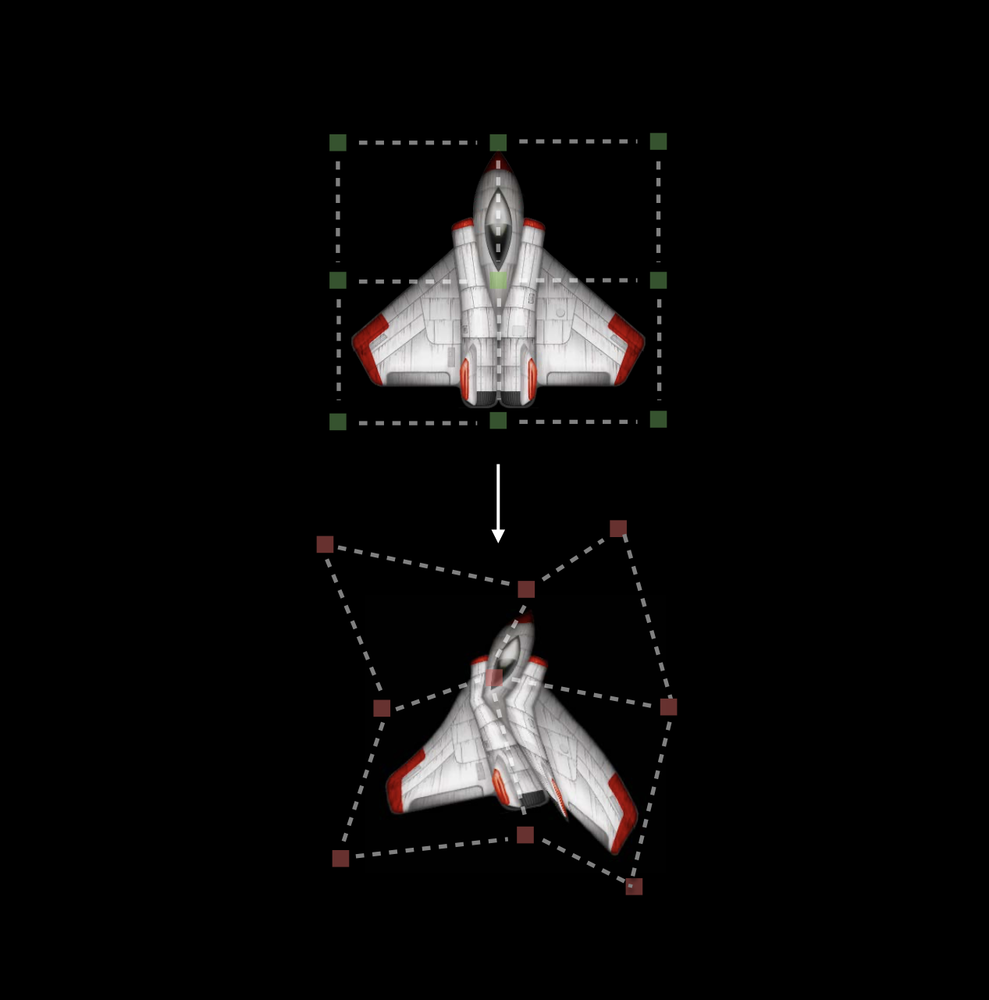

^ なんとか使えないかなと思って、使えるようにしました

^ https://developer.apple.com/videos/play/wwdc2016/610/?time=1718

---


---

# noppefoxwolf/WarpGeometryFilter

- WarpGeometryをCIFIlterとして提供
- 内部的にSpriteKitでオフスクリーンレンダリング
- Metal経由でレンダリング結果をCIImageとして提供


---

[.code-highlight: all]
[.code-highlight: 1-6]
[.code-highlight: 7-12]
[.code-highlight: 13-18]

```swift
let sourcePositions: [SIMD2<Float>] = [
  .init(0.00, 0.00), .init(0.10, 0.00), .init(0.90, 0.00), .init(1.00, 0.00),
  .init(0.00, 0.25), .init(0.10, 0.25), .init(0.90, 0.25), .init(1.00, 0.25),
  .init(0.00, 0.55), .init(0.10, 0.55), .init(0.90, 0.55), .init(1.00, 0.55),
  .init(0.00, 1.00), .init(0.10, 1.00), .init(0.90, 1.00), .init(1.00, 1.00),
]
let destinationPositions: [SIMD2<Float>] = [
  .init(0.00, 0.00), .init(0.10, 0.00), .init(0.90, 0.00), .init(1.00, 0.00),
  .init(0.00, 0.25), .init(0.13, 0.25), .init(0.87, 0.25), .init(1.00, 0.25),
  .init(0.00, 0.55), .init(0.10, 0.55), .init(0.90, 0.55), .init(1.00, 0.55),
  .init(0.00, 1.00), .init(0.10, 1.00), .init(0.90, 1.00), .init(1.00, 1.00),
]
let warpGeometry = SKWarpGeometryGrid(columns: 3, rows: 3,
                                      sourcePositions: sourcePositions,
                                      destinationPositions: destinationPositions)
warpGeometryFilter.setValue(perspectiveCorrectionOutput, forKey: kCIInputImageKey)
warpGeometryFilter.setValue(warpGeometry, forKey: kCIInputWarpGeometryKey)
warpGeometryOutput = warpGeometryFilter.outputImage!
```

---

[.background-color: #000000]

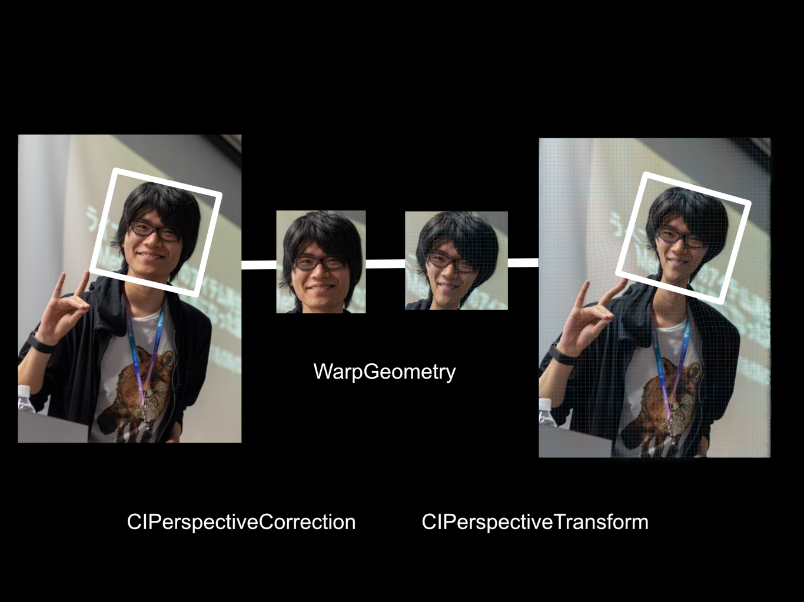

^ これを使って整形するわけですが、顔の角度とかを考え始めると大変なので一回顔を切り抜きます。
^ ここの座標はAR2DFaceDetectorが提供しているので渡すだけです。
^ ※：実演ROMはデフォが有効！！

---

# 実演

---

# noppefoxwolf/iOSDC19-Example

- 今日のデモで使ったもの
- 各フィルタと顔検出のサンプル

---

# まとめ

- 特殊な知識が無くても、デジタル化粧は作れるようになってきた
- 3つのOSSを公開しました

---

# プロダクトへの応用ヒント

---

# リアルタイムに処理する必要があるか否か

- リアルタイムに処理する必要がなければVision.frameworkやMLKitは向いている場合がある

^ 取れる情報量が違うので

---

# アルバムから選んだメディアを処理する必要があるか

- ARKitは物理空間で測定するので、記録されたメディアからは顔検出できない

---

# 録画する必要があるか

- 最終的にSampleBufferとして書き出すかに注意。ステッカーなどは見た目だけなら重ねるだけでも実現できる。

---

# 関連トーク

|||
|---|---|
| Ask the speaker | 14:00 ~ |
| DeNA ブース | - |

^ iOSDCではシェーダやCIImageのトークもあるので合わせて見てみてください