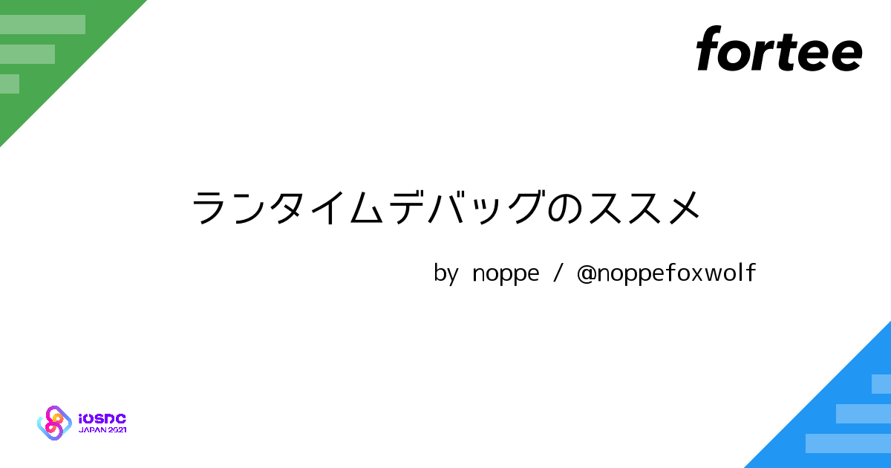
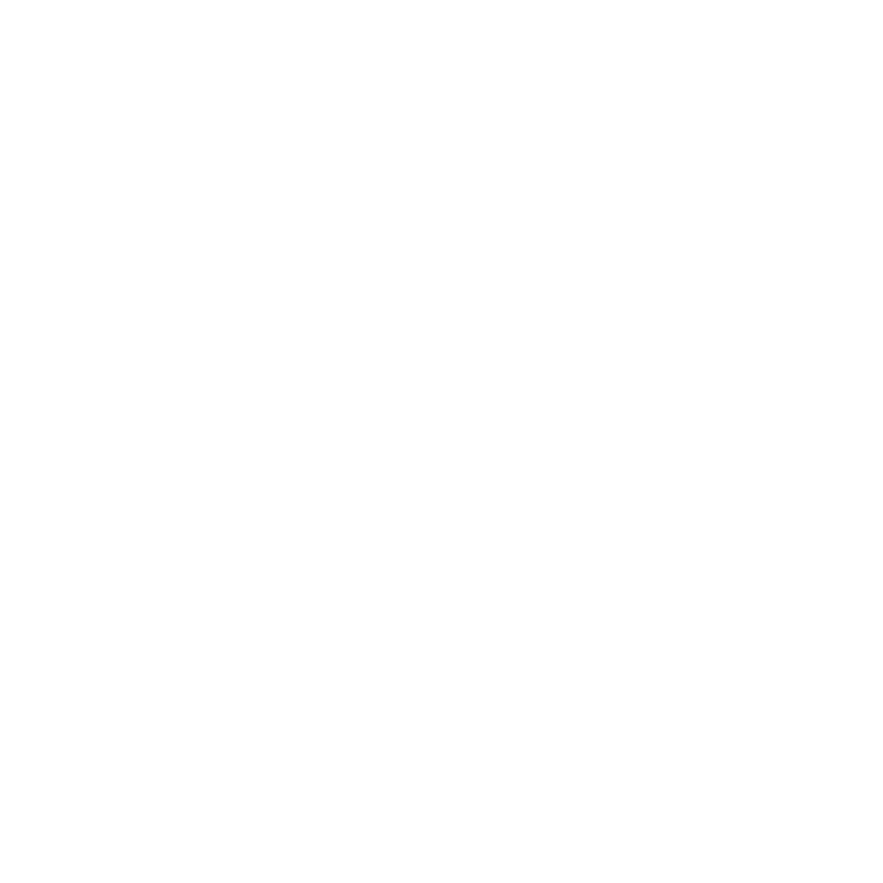
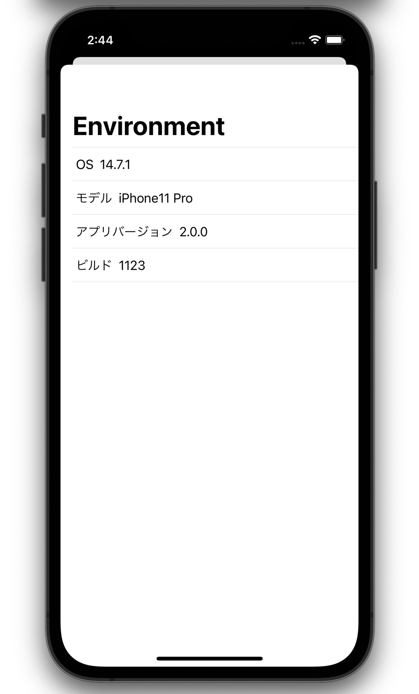
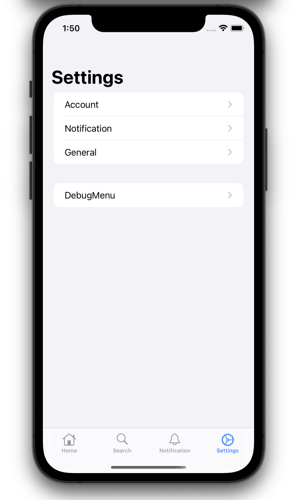
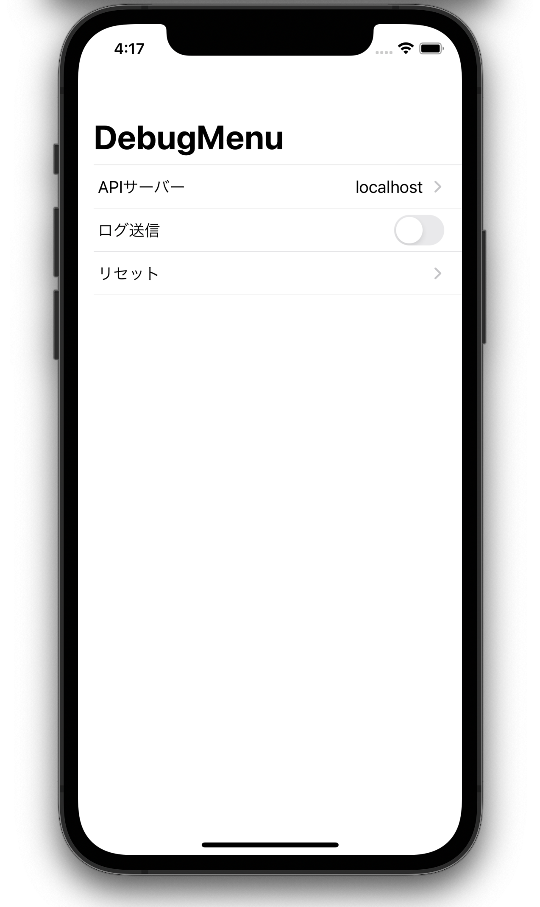
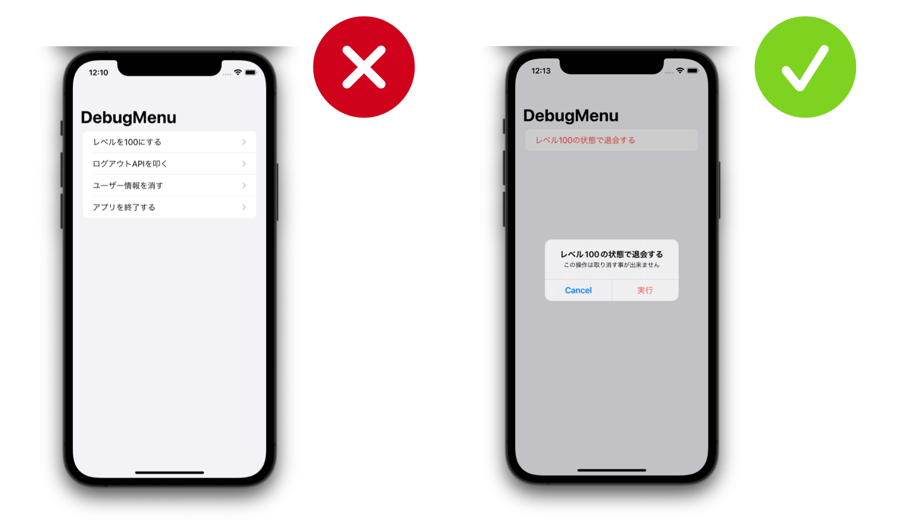
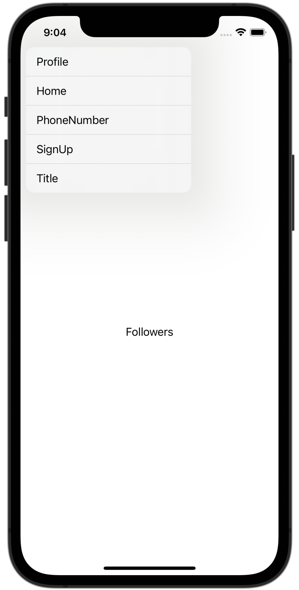
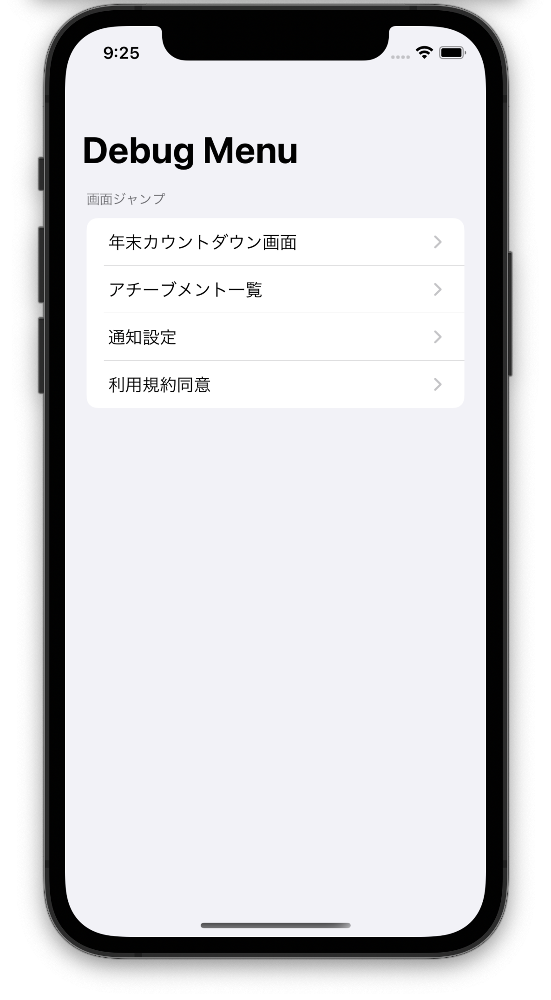
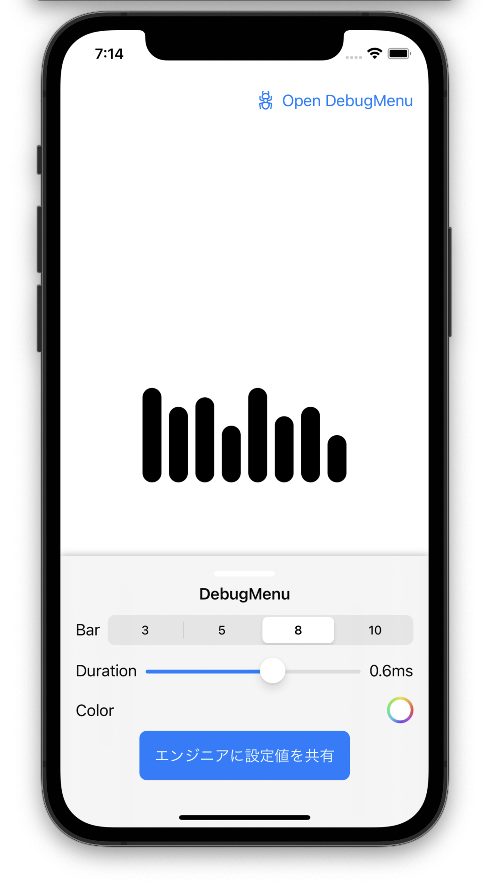

slidenumbers: true
autoscale: true

<!-- Header -->

# ランタイムデバッグのススメ

## iOSDC2021 TrackA Day2

### noppe / iOS app developer

^ おはようございます、iOSDC最終日の朝ということで皆さんお疲れさまです。
^ このセッションではランタイムデバッグのススメというタイトルで、開発テクニックに関するお話をしていきます。

---

# noppe


- 株式会社ディー・エヌ・エー
  - ソーシャルライブPococha
- iOSDC 4年目
- 個人アプリ開発
  - バーチャル自撮りアプリvear

^ 最初に軽く自己紹介をさせてください。
^ キツネのアイコンで活動しているnoppeと言います。
^ 株式会社ディー・エヌ・エーでPocochaというアプリのiOSアプリエンジニアをしています。
^ iOSDCはありがたいことに4年連続で採択して頂いていて、毎年Pocochaに関わる少しコアな話をしているのですが、今回は比較的ライトなセッションになります。
^ お気軽に聞いていただければと思います。
^ また、個人でバーチャルアバターの自撮りアプリのvearを開発しています。
^ 今日話す開発テクニックは、Pocochaとvearの両方で採用しているものなので、小さなアプリから大きなアプリまで参考になると思います。

---



^ さて、早速ですがタイトルにもなっているランタイムデバッグという言葉なのですが

---


^ これは、すいません存在しない言葉でした。

---

[.slidenumber: false]


存在しない単語なので…

# 定義

実行中のアプリで、デバッグをすること[^1]

≒ 実機テスト

とします。

[^1]:このセッションの中での定義

^ なので言葉の定義が必要なのですが、このセッションの中では「実行中のアプリでデバッグをする事」とさせてください。
^ 例えば、Testflightのベータ版アプリをプレイすることも、この定義に含まれます。
^ ここから分かるように、ランタイムデバッグとは皆さんが普段開発の中で行っている、一般的なデバッグ操作の事を指しています。

---

# 対象

- アプリエンジニア
- QA担当者
- デザイナー
...etc

※ 実機デバッグを推奨するセッションではありません。
実機デバッグせざる得ないケースという前提でお聞きください。

^ ランタイムデバッグをするテスターは、エンジニアをはじめ、QA担当者やアニメーションを実機で確認するデザイナーもこれらに含まれます。
^ また、注意して欲しいのですが、今回のセッションではランタイムデバッグが開発においてどのように作用するのかという話をしますが、これはテスト書くのをやめて実機デバッグに一本化しようぜ。という話ではないので、あくまで実機デバッグせざる得ないケース。
^ これはハードウェアに依存することだったり、事業フェーズ的なものだったりと色々あると思いますが、そういう前提でお聞きいただければと思います。

---

[.code-highlight: all]
[.code-highlight: 3]
[.code-highlight: 7-10]

## 一般的な開発フロー

```
1. コーディング・仕様策定・etc
2. コンパイル
3. シミュレータ・デバイス実行・ライブプレビュー
4. UnitTest
5. 結合テスト
6. CI
7. QA
8. ベータテスト
9. リリーステスト
10. 本番テスト
```

^ では早速初めて行くのですが、皆さんどんな時にランタイムデバッグをしているでしょうか。
^ 開発フローを振り返ると、ランタイムデバッグがアプリ開発の中の多くのステップで実施されていることが分かります。
^ 今見えているのは、開発からリリースまでのステップを簡易的に分けたものです。
^ [click]例えば、アプリの開発フローの中で、最初にランタイムデバッグを行うのはコンパイル直後の3番のステップです。
^ このステップでは、アプリのレイアウトやアニメーションといったUnitテストでテストし難い部分を実機で見ながら進めます。
^ 最近ではSwiftUIのプレビューがXcodeで行えるようになったので、1~3はかなり高速に回るようになってきましたね。
^ [click]また、7以降では、アプリはエンジニアの手を離れてadhocやTestFlightといった手段でテスターに届けられます。

---

# ランタイムデバッグの特徴

- 人間が手作業で行う
- エンジニアが行うとは限らない
- 開発ステップの多くで実施される

^ このようにランタイムデバッグは多様な人の手で行われ、そして開発の大きな時間を割いて行われています。
^ これはUnitTestで検証し難い箇所を確認出来る反面、人の手が関わるとトレードオフになるものも存在します。

---

# ランタイムデバッグのトレードオフ

1. 時間的コスト
   - ≒金銭的コスト
   - ≒事業リスク
2. 人による感覚のブレ
   - 何を良し悪しとするか

^ トレードオフになる１つは時間です。
^ これは言うまでもないですが、人間の操作は非常に時間がかかります。
^ それによって、金銭的なコストもかかりますし、競合のリリースサイクルに負ける事業的なリスクもあります。
^ ２つ目は人による感覚のブレです。人によってスクロールの滑らかさを問題とする人もいれば、そうでない人もいます。
^ これらの課題意識のすり合わせはどんなに定義したとしても、どこかで起きているでしょう。
^ この２つの課題感について、エンジニアが工夫出来ることを今日はお話しします。

---

## 1.時間的コストの改善

^ まずは一つ目の時間的コストの改善についてお話しします。

---

[.code-highlight: all]
[.code-highlight: 3-6]

## 検証速度の改善

### ランタイムデバッグのフロー

```
1. コンパイル
2. 転送
3. 環境の確認
4. 画面までの操作
5. 動作検証
```

これらのどこにどんな時間がかかっているのかを知る必要がある。

^ 時間的コストを改善するには、ランタイムデバッグにおいて何が時間がかかっているのかを知る必要があります。
^ 今見えているのは、ランタイムデバッグの目的である動作確認に辿り着くまでのステップになります。
^ [click]コンパイルや転送の高速化は他のセッションでも話されている議題かと思いますので、ここでは3番以降をランタイムデバッグを上手に使って改善をしてみます。

---

## 検証速度の改善

### 3.環境の確認

- バージョン番号、ビルド番号
  - ログを見る
- OSのバージョン、モデル
  - 設定アプリから参照
- ビルドの最終担当者
...etc



^ アプリを転送してから最初に行うのは、現在動作している環境が想定しているものであるかを確認することです。
^ このステップを間違えると、ここから先の検証が無駄になってしまいます。
^ この確認作業は意外と時間がかかるものです。例えばOSバージョン一つ見るのに、iOSの場合は設定から2タップが必要になります。
^ 自分の関わったプロダクトでは、バージョンやビルド番号を毎回bitriseを開いて見にいっているケースもありました。

---

### 3.環境の確認

A. アプリの中で見れるようにし、操作を省く

なんでもかんでも表示せず、必要な情報か見極める

- adhocビルドを触っている人にヒアリング
  - 確認にコミュニケーションが必要なものがないか
  - 手作業による操作が必要なものがないか



^ これらの情報は、アプリの中で見れるようにすることで無駄な操作を省く事が出来ます。
^ ただし、なんでもかんでも表示しないようにしましょう。
^ よくあるケースとして、アプリのメモリ残量やストレージ容量などを事細かに表示している事がありますが、逆に情報を探す時間がかかってしまう事があります。
^ 詳細を表示する画面が必要な場合は別で用意しつつ、ダッシュボード的に重要な情報に絞った画面を用意しましょう。テスター向けの画面でもUIUXを意識することが大切です。
^ 重要な情報の定義はサービスによって異なると思いますので、実際にテスターにヒアリングすることをお勧めします。

---

[.slidenumber: false]

### デバッグメニュー

- 開発関係者向けの特殊な画面

- 非エンジニア[^2]にとって、非常に強力な存在

[^2]:実装の変更が出来ないテスター



^ また、このような開発でのみ必要な情報を表示する先として、デバッグメニューを用意することをおすすめします。
^ デバッグメニューは、本番のアプリには表示されない特殊な画面です。
^ ゲームの開発などでよく見かける機能ですが、アプリの開発においても有効な手法です。
^ そして、何よりも自分でアプリの挙動を弄れるエンジニア以外にとっては、デバッグメニューは非常に強力な存在になります。

---

### デバッグメニューの実装

1. 適当な画面を用意する
2. 本番で呼べないようにする


^ デバッグメニューを実装するために必要な事はたったの２つです。
^ 一つは、適当な画面を用意すること。まずは先ほど出ていたOSやアプリバージョンが確認できるViewControllerがあれば良いでしょう。
^ そして、それを本番では表示しないことです。

---

[.code-highlight: all]
[.code-highlight: 6-8]
[.code-highlight: 5, 9, 13, 17]

### デバッグメニューの実装

```swift
func onTapSettings(section: Section) {
    switch section {
        case .general:
            ...
        #if DEBUG // #endifまでのコードは本番に含まれない
        case .debugMenu:
            let vc = DebugMenuViewController()
            present(vc, animated: true)
        #endif
    }
}

#if DEBUG
final class DebugMenuViewController: UITableController {
    ...
}
#endif

```


^ コードに落としてみると、このようになります。
^ [Click]通常のアプリ開発と同じように、ViewControllerをpresentするだけです。
^ [Click]ハックされたiPhoneでは直接関数が呼び出せるため、このようにDEBUGフラグを使って実行バイナリから実装を取り除く必要があります。

---

### デバッグメニューの実装

開発用機能をモジュール化し、安全に分離するには

|||
|---|--:|
|Swift Package中心のプロジェクト構成とその実践|Day2 TrackC 14:50|
|大規模なアプリのマルチモジュール構成の実践|Day2 TrackA 11:30|

^ デバッグ機能を一つのモジュールにまとめたいケースもあると思います。
^ その場合、本番のアプリにリンクされないようにするなどの工夫が必要になります。
^ この方法については、この後の２つのセッションにヒントがあると思いますので見てみることをオススメします。

---

## 検証速度の改善

### 3.環境の確認

再ビルド・再インストールを伴う環境

- 接続先サーバーの設定
- チュートリアル表示のリセット
- キャッシュの削除

^ さて、話を元に戻します。
^ 環境の中には、アプリを再ビルドしたり、再インストールしないと変更できないものがあるかもしれません。
^ よくあるのは、開発とadhocでサーバーを分けているケースです。ビルドによって環境を固定すると、一時的に切り替えたい時に再ビルド・インストールが必要になります。
^ コロナ禍では、席に来てもらってデバイスに直接転送すると言ったこともし難いですよね。
^ なので、この回数はなるべく抑えたい箇所になります。

---

## 検証速度の改善

### 3.環境の確認

再ビルド・再インストールを伴う環境は…
デバッグメニューから設定・実行できるようにする



^ これらの課題は、デバッグメニューから直接選択・実行出来るようにしておくことで解決します。
^ つまりデバッグメニューは、環境の参照だけではなく変更も行えるということです。
^ ここで少しデバッグメニューのUXについても触れておきましょう。

---



^ 常に意識しなくてはならないのは、テスターは実装を知っているとは限らない点です。
^ 再起動が必要なものがあればその旨を表示してアプリを殺したり、強い権限のものは色を変えたりしましょう。
^ そして、機能を整頓するのも重要です。
^ アプリの仕様が増えるほどデバッグメニューは増えますが、それでは目的の機能を探す時間がかかってしまいます。
^ 担当者や利用シーンでまとめたりして探しやすくしましょう。

---

## 検証速度の改善

### 4.画面までの操作

- 画面遷移が多い
- 通信や重い処理が挟まるほど時間がかかる
- 遷移条件が厳しい

### Hint

- 起動から`onAppear()`や`viewDidAppear()`までの時間を計測する



^ 環境の準備が出来ると、いよいよアプリを触っていくわけですが該当の画面までが遠いというケースがよくあります。
^ 奥まった場所にある画面や、サーバから特定条件が返ってこないと遷移できない画面などがこれにあたります。
^ テスターが起動してからonAppearに達するまでの時間のログを取っておくと、時間のかかっている画面が特定できます。

---

## 検証速度の改善

### 4.画面までの操作

1. デバッグメニューから直接飛べるようにする
2. URLスキームから起動する



^ これらの解決策として、デバッグメニューから直接ViewControllerを呼び出すことで、操作時間を短縮する事ができます。
^ また、アプリ全体でルーティングが施されているアプリの場合はURLスキームを叩いて遷移することもできます。
^ URLスキームから起動する場合は、アプリが自身で再起動する必要があるため少し工夫が必要になります。

---

### TIPS

Q. アプリを再起動するには

A. Shortcut.appを使う
   1. 受け取ったURLをSafariで開くショートカットを作成
   2. アプリから自身のURLスキームを含んだショートカット[^3]を叩く
   3. アプリを終了させる
   4. Shortcut.appがURLスキームを実行
   5. アプリが再起動する

[^3]:shortcuts://run-shortcut?name=shortcutName&input=text&text=urlScheme

^ アプリを再起動するには、AppleのShortcutアプリを利用します。
^ 仕組みは簡単で、アプリから自分のURLスキームを叩くショートカットを実行し、そのままアプリを終了するだけです。
^ アプリが終了した後に、ショートカットがURLスキームを使ってアプリを起こします。
^ デモを見てみましょう。

---

### DEMO


^ これはショートカットをアプリからインストールしている様子です。
^ インストールは最初に一度だけしておけば問題ありません。
^ 次に、Relaunchボタンを押してアプリを終了させています。
^ ショートカットがアプリを立ち上げます。
^ こうして再起動が実現します。launched atの時間が更新されているのが分かると思います

---

## 検証速度の改善

### 5.動作検証

- 時短し難い箇所
- フィールの検証
  - アニメーション・ジェスチャー・感覚フィードバック

^ さて、最終ステップがいよいよ動作検証なのですが、そもそもこのステップをするためのランタイムデバッグなので、中々時短するのが難しい箇所でもあります。
^ しかし、検証内容によっては大きく改善する事ができます。
^ 特にアプリのフィールに関する検証は、改善の余地があります。
^ フィールの改善は本番に近い体験をもって判断するため、実機で行うことが多いです。
^ しかし、微調整も多く何度も触り心地を擦り合わせるためにビルドした事がある方も多いかと思います。

---

## 検証速度の改善

パラメータの調整は実行中に出来るようにする

- 設定値を共有出来るようにする
- デバッグメニューは同じ画面内に持つ
- 実装コストがかかるので、アプリのコアの部分の利用に絞る



^ そこで、フィールの検証に関してはデバイス上でパラメータ変更が出来るようにしてしまいます。
^ こうすることで、アプリを触りながらアプリから離れずに調整をする事ができます。
^ パラメータ変更のUI実装はそこそこ実装コストがかかるので、アプリの肝になる部分に絞って行うと良いでしょう。

---

## 検証速度の改善

### Case Study


Find Myでは、パーティクルの数や背景のブラー濃度を調整できる機能が存在していた。[^4]

AirTagがなくても、見つけるまでのアニメーションが自動再生できる。

実機を使いつつ、物理的な制約を取り払ってフィールのトライアンドエラーを試せる良い例

[^4]:https://www.cultofmac.com/741835/enable-airtag-debug-mode/

^ 例えば、AppleのFindMyアプリではAirTagの探索をする画面にデバッグメニューが存在していてエンドユーザーが呼び出せる時期がありました。
^ ここでは画面内のカメラ解像度やブラー濃度が調整可能で、実際の動作を見ながらフィールを改善していたと推測できます。
^ またアニメーションに関してもAirTag無しで実行できるAutoTestがあるなど、物理的な移動を省略してフィールの最適化を行っていった痕跡が見て取れます。
^ 余談ですが、このように時々デバッグメニューは本番の環境で呼べてしまう事があるので触ってみると、どんな機能が実際の現場で検証されているのかを知るのも良い勉強になります。

---

## 検証速度の改善

### Recap

- デバッグメニューを活用して、アプリで検証を完結することで検証時間を短縮する
  - 手作業やコミュニケーションを減らす
  - 再ビルドや再インストールを避ける
  - テスターへのヒアリングを怠らない
- テスター向けのUXを追求する

^ 検証速度の改善は、デバッグメニューを活用することでインストールや手作業のコストを軽減し、効率的に行う事が出来ました。
^ また、使いやすい情報設計を心がけることでよりスムーズな検証が行えます
^ さて、次にランタイムデバッグにおいてトレードオフになる感覚のブレについて解説します。

---

## 人による感覚のブレ

UnitTestと異なり人間が触る以上、感覚の違いが起こりうる
定性的な情報が集められる反面、人によって報告の基準はまちまち
また、報告されたものを改善するコストが高く、自然と意見が集まりにくくなってしまう。

^ ランタイムデバッグは先ほど言った通り、フィールを検証する側面が強いと言えます。
^ それは定性的な意見が得られるというメリットがある反面、問題として報告するかの基準が定まらないとも言えます。
^ また、報告しても定性的な問題の検証は非常に時間がかかるわりには改善が見えにくく、自然と意見が集まりにくくなってしまう側面もあります。

---

## 人による感覚のブレ

チーム全体で感覚を合わせる努力はした上で…

- 定性的な意見の裏付けをする
- 定量的な指標を見える化する

^ これらの問題はチーム全体の感覚を合わせる努力をした上で、
^ 定性的な意見の裏付けをして、検証コストを抑えること
^ そして、定量的な指標の見える化をする事で、共通認識を高めることで解決します。

---

## 人による感覚のブレ

### 定性的な意見の裏付けをする

裏付けがあることで、検証コストが下がりチケットは有意義なものに
重い・遅いなど、定性的な意見はログを見ても分からないことが多い。
`RPScreenRecorder`を使うことで操作の15秒前までを記録することができる

^ 定性的な意見というのは、裏付けを取ることで改修コストがグッと下がります。
^ そこで直前の操作を映像で振り返ることで、定性的な意見の言語化を促します。
^ ビデオカメラを用意して操作している様子を録画しても良いのですが、ここではランタイムデバッグらしくアプリで完結させてみましょう。
^ iOS15から使えるReplayKitのクリップバッファリングを使って、録画停止から15秒前までの映像を記録する事が出来そうです。

---

```swift
import ReplayKit

// 起動してすぐにクリップのバッファリングを開始する
func launched() async throws {
    try await RPScreenRecorder.shared().startClipBuffering()
}

...

// 違和感を感じたらすぐにクリップをシェアしてもらう。
func onTapClipShareButton() async throws {
    let url: URL = URL(string: "")!
    try await RPScreenRecorder.shared().exportClip(to: url, duration: 5)
    try await RPScreenRecorder.shared().stopClipBuffering()

    shareVideo(url)
}
```


^ クリップバッファリングは、通常の画面録画と異なりドライブレコーダーのように停止するまでの15秒間を録画します。
^ これを利用して、テスターは問題が起きてからレポートボタンを押すだけで、例え定性的な感覚であったとしてもレポートする事が出来ます。
^ RPScreenRecorder自体はビデオを書き出すところまでしかしませんが、開発に利用しているissue管理にチケットを切るところまでをランタイムで出来ると効率的に時間を使う事が出来ます。

---

## 人による感覚のブレ

### 定量的な指標を見える化する

ランタイムデバッグでは、全ての機能が結合された状態で検証ができる。
全体で決めた品質指標を可視化して、テスター間の共通認識を高める。

- FPS
- 熱
- バッテリー消費
- ...etc


^ アプリの品質指標が明確にある場合、指標の見える化をすることで品質の見過ごしを防ぐ事が出来ます。
^ 一つの画面に機能が集中する場合などは、各エンジニアが自分の開発した機能だけでなく全部が結合した状態の性能を測定する必要があります。
^ そこで、右のスクリーンショットのように、画面上に現在のパフォーマンスと指標を表示しておくことで大雑把に指標を超えてしまったかを知る事が出来ます。
^ ここで超えたものをInstrumentsなどで詳細に分析することで、細かな改善を素早く行えます。

---

## 人による感覚のブレ

### Recap

- 定性的な意見の裏付けをする
  - これまで検証の難しかった課題に、画面録画を合わせて対策
- 定量的な指標を見える化する
  - 全体で品質指標の意識を高める

^ 

---

# デバッグメニューを導入するには

---

# デバッグメニューを導入するには

- 自分で書く
- Settings.bundle
- ライブラリを導入する

---

# 自分で書く

## メリット

サービスに最適化したデバッグメニューが作れる

## デメリット

なるべくサービスの体験にフォーカスした方が良い

^ これは持論ですが

---

# Settings.bundle

## メリット

簡単に作れる
設定変更時に自動でアプリが再起動する

## デメリット

自由度が少ない

---

# ライブラリを導入する

## メリット

簡単に作れる

## デメリット

アプリと別のレイヤーで動作する

---

# noppefoxwolf/DebugMenu

- vear、Pococha、NAHの全てで採用しています
- 過去にvineは画面上にデバッグメニューを表示できる機能を入れていた
- アプリ全体で常に利用できるのが特徴

---

# DEMO

---

# デバッグメニューのコツ

- 担当者・機能ごとにまとめる
- 本番ビルドに含めない
- 要らない機能を入れない

---

- Recap（要点の繰り返し）
    - アプリ開発において、ランタイムデバッグの存在は開発効率を向上させることに貢献する
    - デバッグ機能もチームメンバーに対する製品の開発。ヒアリングを含め気を抜かずにやる
    - 基本はUnitTest
- サマリ（つまり）
    - 内向きの機能開発もエンジニアの仕事の一部

---

# More Information

- ターゲット分けについて
- as

---


# Thanks

---

メモ

検証条件画面のbefore-after　必要なのだけ切り出した画面を作る