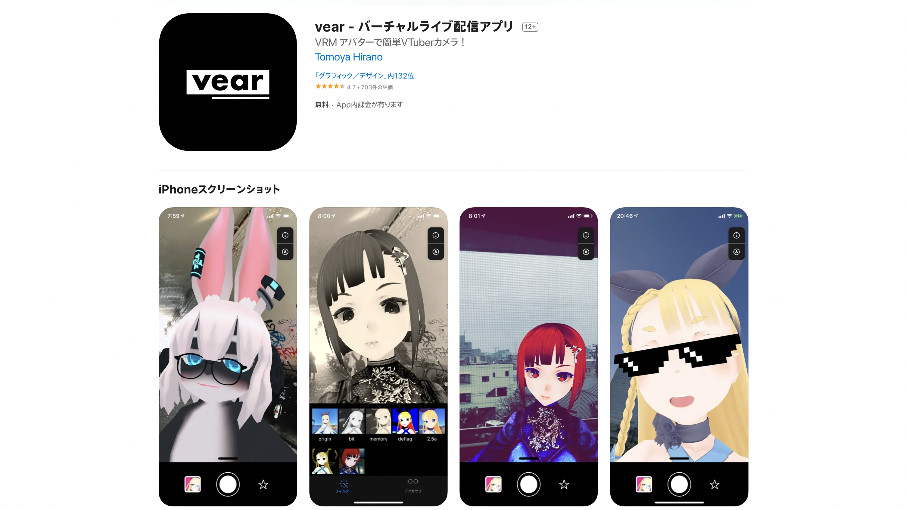
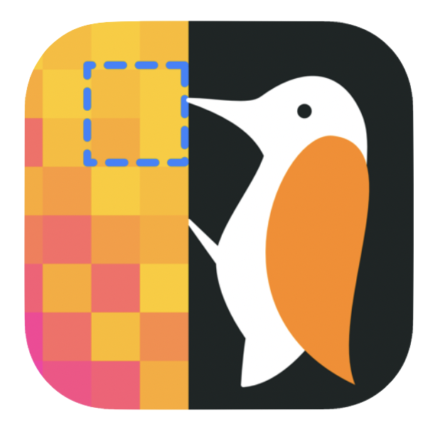
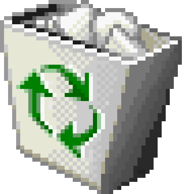
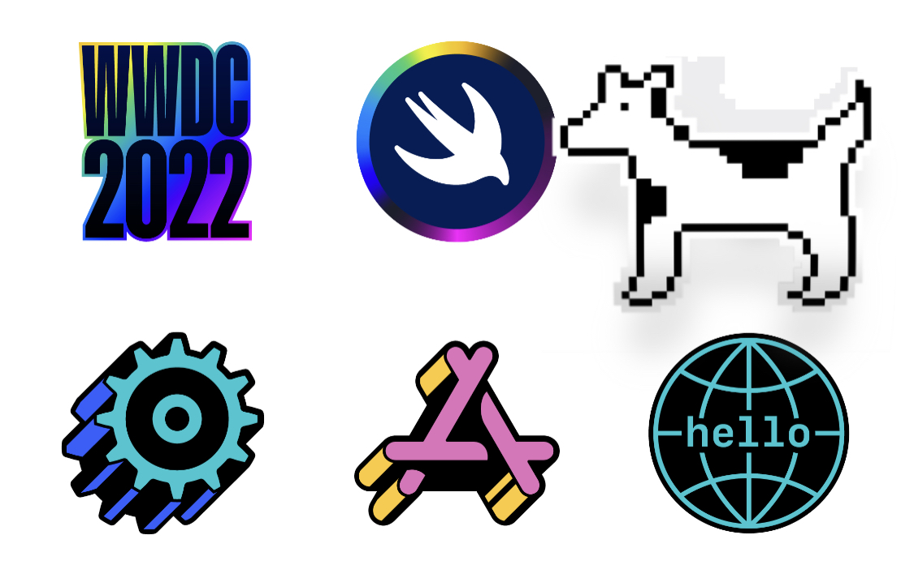
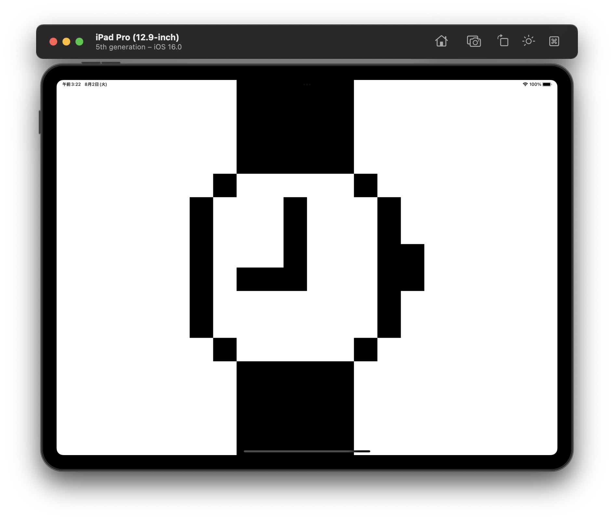
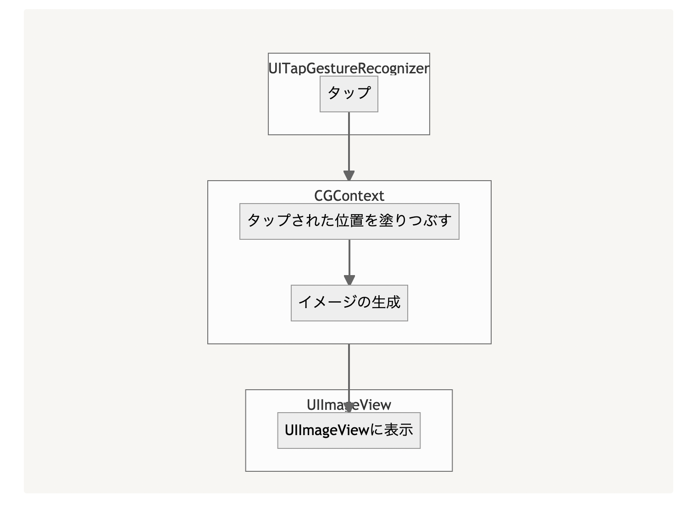
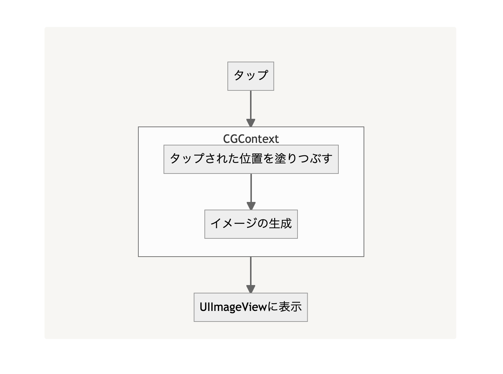
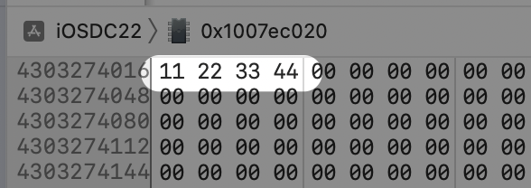

slidenumbers: true

# CoreGraphicsでドット絵を描こう
## Track C レギュラートーク（20分）

---

# noppe


- Twitter: noppefoxwolf
- 株式会社ディー・エヌ・エー
- 個人アプリ開発者
- iOSDC18~21 登壇
- きつねが好き


^ こんにちは、株式会社ディー・エヌ・エーでiOSアプリエンジニアをしているnoppeです。
^ 今日は個人で開発しているアプリを例に、ドット絵を描くアプリを作るために必要なテクニックを紹介します。
^ SNSでは、このきつねのアイコンで活動しているので見かけた際はぜひ声をかけてください。
^ では、初めて行きたいのですが少し、自分の活動について紹介させていただきます。

---


^ まず、株式会社ディー・エヌ・エーでは、Pocochaというソーシャルライブアプリの開発をしています。
^ ライブ配信というiPhoneの限界に挑むサービス開発はとても楽しいので、興味のある方はぜひ一緒に働きましょう！

---



^ また、個人ではvearというVTuber向けの自撮りアプリの開発をしています。
^ 移動中や、外出先でもトラッカーなしでバーチャルの撮影が出来る画期的なアプリです。
^ 今回数量限定ですが、1階でステッカーを配布しているので欲しい方はぜひお取りください。

---



## Editormode

^ そして、今日お話しするEditormodeというドット絵クリエイター向けのデジタルイラストレーションアプリを開発しています。

---


^ Editormodeはこの映像のように、「ドット絵」を描くためのアプリでUIやツールをドット絵クリエイター向けに最適化しています。
^ 一般的なアプリと異なるのは、このアプリはOpenCVやUnityに頼らずにUIKitとCoreGraphicsといった標準的なフレームワークのみで構築されているところです。
^ そうすることで、UIKitの高いパフォーマンスを使って使い心地の良い体験を実現しています。
^ 今日はこのようなドット絵を描くためのアプリを、CoreGraphicsのAPIでどのように実現しているのかを紹介します。

---

# Agenda

1. ドット絵エディタとは
2. シンプルなドット絵エディタを作る
3. CoreGraphicsの拡張
4. パフォーマンスの改善

^ まず今日お話しするのは、ドット絵についての歴史やトレンドを確認してこれから扱うドット絵エディタとはどんなものなのかを理解します。
^ 続いて、実際にCoreGraphicsとUIKitを使ってシンプルなドット絵エディタを開発して、ワークフローやCoreGraphicsのベーシックな使い方を説明します。
^ その後、CoreGraphicsに存在しないAPIやよりドット絵を扱うアプリとしての完成度を上げるための方法を学びます。
^ 最後にMetalやCoreImageといったフレームワークを使って、ドット絵アプリのパフォーマンスを向上させるコツについてお話しします。
^ それでは、ドット絵エディタについて見ていきましょう

---

# ドット絵エディタとは


^ 最近ドット絵が話題になった例として、今年のWWDC22があります。

---


^ 今年はデジタルラウンジでモノクロームピクセルアートチャレンジが開催されて、現代のアプリアイコンを白と黒の２色のアイコンに描き直すというチャレンジが開催されました。
^ 実際に私もEditormodeを使って参加しました。右上のマップアイコンがそれですね。
^ これらの作品はWWDCのデイリーダイジェストで見ることが出来ます。
^ これらの作品を観察すると分かるとおり、薄い色を白と黒のチェック模様で再現したり、重要で無い要素を省いたりと、有限なリソースの中で最大限表現するための工夫が散りばめられています。
^ こういったいくつかのドット絵の工夫をツールとして提供することも、ドット絵専用アプリの価値と言えるでしょう。

---


## 28x28 2bit

^ またドット絵は、このように小さな解像度の中で絵を描く表現方法です。
^ 描画に割けるメモリが小さいコンピューターやおもちゃのような解像度の小さいゲーム機などで使われていました。

---



## 48x48 8bit

<!-- https://oldwindowsicons.tumblr.com/tagged/windows%2098 -->

^ デバイスの進化とともに、ドット絵は使われる色が増えたり、解像度が増して細かくなっていきます。

---



## 300x300 10bit

^ そして現代で使われる画像のほとんどはベクターや写真といった画像が一般的になり、手作業で描かれたドット絵はアートの側面で使われることが多くなりました。
^ このように、ドット絵は地続きに姿を変えたこともあり、どれほど小さければドット絵なのか、色が少ないならドット絵なのか、定義が難しい表現方法でもあります。
^ しかし、解像度の制約の強い環境ほど、自然にドット絵らしく見えるので、ドット絵を扱うアプリは、この制約を再現することでドット絵であることに説得力を持たせようとします。
^ Editormodeのようなドット絵エディタの意義とは、こういった制約を付けた環境をユーザーに提供して、自然にドット絵をかけるような環境を用意することにあるとも考えられます。
^ では、実際にiPadにドット絵を表示して本来の画面解像度よりも低い解像度のように表示してみましょう。

---

## ドット絵を表示する

```swift
imageView.contentMode = .center
imageView.image = UIImage(named: "watch")
```


^ これは、UIImageViewを使ってiPadに16x16のドット絵を等倍で表示した状態です。
^ 現代のディスプレイは非常に高解像度なのでドット絵は見えないほど小さく表示されます。

---

## ドット絵を表示する

```swift
imageView.contentMode = .scaleAspectFit
imageView.image = UIImage(named: "watch")
```


^ 次にUIImageViewのcontentModeをscaleAspectFitにして、画面いっぱいに表示してみます。
^ これで時計のアイコンが映っていることは分かりましたが、ぼやけてしまっています。
^ UIViewにはこのように、小さい画像を拡大する際にスムーズに補完する機能がデフォルトで設定されています。

---

## ドット絵を表示する

```swift
// Use nearest magnificationFilter
imageView.contentMode = .scaleAspectFit
imageView.layer.magnificationFilter = .nearest
imageView.image = UIImage(named: "watch")
```

```swift
// SwiftUI
Image(...).interpolation(.none)
```

-　画像自体のリサイズは重くメモリを浪費するのでNG



^ 拡大時の補完のアルゴリズムはlayerのmagnificationFilterが担っていて、これをnearestにすることでドット絵をクッキリと描画することができます。
^ SwiftUIでもinterpolationをnoneにすることで同じ結果を得ることができます。
^ このようにドット絵を表示する際は、普通のアプリと同じようにUIImageViewやSwiftUIが使えます。
^ 注意点として拡大するために、実際のイメージをリサイズすることは避けましょう。
^ リサイズは非常に時間がかかる上に、大量のメモリを消費します。

---

# シンプルなドット絵エディタを作る

---


^ では、シンプルなアプリの開発に移りましょう。
^ ドット絵エディタは、ただ描画するだけでは成り立ちません。
^ タップした位置を塗りつぶすといった編集の機能も必要になります。

---




^ これらの一連の流れは非常にシンプルで、タップした位置を塗りつぶし、それを表示する繰り返しです。
^ この処理をCoreGraphicsとUIKitで実現するには、タップを検知するためのUITapGestureRecognizer、絵を描くためのキャンバスのCGContext、表示をするUIImageViewといった登場人物が必要になります。

---

## ドット絵エディタのワークフロー

[.code-highlight: all]
[.code-highlight: 5]
[.code-highlight: 6]
[.code-highlight: 7]
[.code-highlight: 8]
[.code-highlight: all]

```swift
let imageView = UIImageView()
let context = CGContext()

func setup() {
	imageView.onTap = { point in // 1
		context.fill(point) // 2
        let image =  context.makeImage() // 3
		imageView.image = image // 4
	}
}
```



^ 疑似的なコードにするとこのようになります。
^ 1. まず、ImageViewがタップされたことを検知します。
^ 2. 次にcontextにタップした位置のピクセルを塗りつぶします。
^ 3. 最後にcontextから画像を取り出し
^ 4. ImageViewにセットして描画します。
^ 非常にシンプルですね。これの繰り返しです。
^ それでは省略している部分を詳しく説明していきます。

---

## グレースケールのCGContextの初期化

[.code-highlight: all]
[.code-highlight: 3]
[.code-highlight: 4-5]

```swift
// グレースケール専用のCGContextを生成
let context = CGContext(
    data: nil,
    width: 16,
    height: 16,
    bitsPerComponent: 8,
    bytesPerRow: 1 * 16,
    space: CGColorSpaceCreateDeviceGray(),
    bitmapInfo: CGImageAlphaInfo.none.rawValue
)
```

^ 先ほどの解説でキャンバスにあたるのが、このCGContextです。
^ 1.CGContextでは、サイズと使える色の領域、データの格納方法を指定します。
^ 昨日PictureInPictureの解説をしたちぎらさんのスライドでも出てきましたね。
^ これだけ引数があると、見ただけでうっとなりますが１つづつ噛み砕いて見ていきましょう。
^ このコードは、256階調の白黒が使える16x16のCGContextを作るコードになっています。
^ 第一引数のdataは、CGContextが参照する画像のメモリ領域です。nilを与えると他のパラメータを元に自動で領域を確保します。画像のデータを渡すことで最初から書き込まれたCGContextを作ることもできます。
^ 2.width, heightは画像のサイズです。

---

## bitsPerComponent

- 1,2,4,8 bitから1色の階調を指定する
    - 4bit = 16階調
    - 8bit = 256階調
- RGBなど、複数のコンポーネントで色を表すこともあります


^ bitsPerComponentは、1色の階調を指定します。4bitなら16階調、8bitなら、256階調ということです。
^ RGBなど、３つのコンポーネントで色を表す場合もありますが、その場合でも１つのコンポーネントの階調を指定します。
^ 今回は256階調のグレースケールにするので、8ビットを指定します。

---

## bytesPerRow

- 画像の横一列が何バイトになるか

- 8bit(1byte)なら コンポーネント数 x 横のピクセル数

|色空間|横幅のバイト数|
|---|---|
|グレー| 1 * width = 16 |
|フルカラーRGB| 4 * width = 256 |

^ 続いてbytesPerRowは、画像の横一列が何バイトになるのかを指定します。
^ 色のコンポーネント数x横のピクセル数で計算することができます。
^ 今回は１ピクセルが8bitつまり１バイトになるので、横のピクセル分16をかけて、1x16で16を指定します。

---

## space

- カラースペース

|色空間|クラス|
|---|---|
|グレー|`CGColorSpaceCreateDeviceGray()`|
|フルカラーRGB|`CGColorSpaceCreateDeviceRGB()`|


^ spaceは色空間の指定です。今回はグレースケールなのでCGColorSpaceCreateDeviceGrayを指定します。

---

## bitmapInfo

- アルファチャンネルの場所 | バイトオーダー | フォーマット　のビットマスク

例

- CGImageAlphaInfo.noneSkipLast.rawValue | CGImageByteOrderInfo.order32Little.rawValue | CGImagePixelFormatInfo.packed.rawValue
- CGImageAlphaInfo.none.rawValue

^ bitmapInfoには、コンポーネントのアルファの位置やバイトオーダーなどを指定します。今回は透過度は無いのでnoneを指定します。

---


^ これで256色の色が使えるCGContextを作ることができました。

---

[.code-highlight: all]
[.code-highlight: 1]
[.code-highlight: 2-6]
[.code-highlight: 8-11]
[.code-highlight: all]

## contextの画像を描画する

```swift
let cgImage: CGImage = context.makeImage()!
let uiImage: UIImage = UIImage(
    cgImage: cgImage,
    scale: 1,
    orientation: .downMirrored // UIImageの座標系に変換
)

// UIKit
imageView.image = uiImage
// SwiftUI
Image(uiImage: uiImage)
```

^ 作ったcontextが持つ画像を描画するには、
^ 1.まずはmakeImage関数でCGImageとして画像を取り出します。
^ 2.次にUIImageで包みます。
^ ここでの注意点として、UIImageが左上をx0,y0の起点としているのに対して、CGImageは左下を起点としているため、orientationを指定して回転させてあげる必要があります。
^ 3.こうして作られたUIImageは、みなさんご存知の通り、UIImageViewやSwiftUIのImageで描画することができます。

---

[.code-highlight: all]
[.code-highlight: 1-2]
[.code-highlight: 3-6]
[.code-highlight: 7]
[.code-highlight: all]

# 色の塗りつぶし

```swift
let color = CGColor(gray: 0, alpha: 1)
context.setFillColor(color)
let path = CGPath(
    rect: CGRect(origin: point, size: CGSize(width: 1, height: 1))
)
context.addPath(path) // Pathの追加
context.fillPath()
```

^ 最後にcontextに色を塗る処理を紹介します。
^ 1.contextのsetFillColorを呼ぶと、それ以後の塗りつぶし色が指定した色になります。
^ 2.次に塗りつぶすパスを指定します。今回は1ピクセルを塗り潰したいので1x1の矩形を指定しました。
^ 3.最後にcontextのfillPathメソッドを呼ぶと、contextに追加されたpathが塗りつぶされます。
^ これでドット絵を描くアプリを作ることが出来ました。
^ それでは、次はこのアプリの完成度を上げていきましょう。

---

# CoreGraphicsの拡張

---


^ 先ほど作ったアプリの続きです
^ UIPanGestureRecognizerと楕円のパスを使って、楕円を描画する機能を追加してみました。

---


^ しかし、実行してみると違和感があることに気が付きます。
^ 円の縁に小さなドットが描画されてしまうのです。

---


^ Editormodeの円ツールと見比べると違和感が分かりやすいです。
^ CGContextで線を書く場合、アンチエイリアスを無効化しますが、それをするとこのように小さい図形は不恰好になってしまいます。
^ これを防ぐには、独自に描画関数を実装する必要があります。

---

## CGContextに自作関数を生やす

```swift
extension CGContext {
    func fillEllipseLine(in rect: CGRect) {
        // 塗りつぶすパスを作る
		let path = makeEllipsePath(in: rect)
        // パスを追加
        addPath(path)
        // 追加したパスを塗りつぶす
        fillPath()
    }
}
```

^ CGContextの描画関数を自作するには、先ほどの矩形と同じように塗り潰すパスを作り、addPathで追加しfillPathを呼んで塗り潰すだけです。
^ パスさえ作れてしまえば、どんな形状でも塗り潰すことが出来ます。

---

## Bresenham's line algorithm[^2]

- 1962年、IBMのジャック・ブレゼンハムが開発
- 直線から最短距離にある画素を並べる
- 円を描画する発展系のアルゴリズムがある
- **noppefoxwolf/swift-line-algorithms**


[^2]: https://ja.wikipedia.org/wiki/ブレゼンハムのアルゴリズム

^ 肝心の塗りつぶすパスの求め方ですが、ブレゼンハムの線分描画アルゴリズムを使うことで得ることが出来ます。
^ このアルゴリズムはコンピュータの最初期に生まれたもので、多くの低解像度なモニターで使われてきた実績のあるアルゴリズムです。
^ 基本は線を描くアルゴリズムですが、円や曲線を描くために発展させたものもありそれらを利用することで楕円を描くことが出来ます。
^ Swiftでの実装はnoppefoxwolf/swift-line-algorithmsで公開しているので、ぜひ確認してみてください。

---

# CoreGraphicsの拡張2

---

## バケツツール

- 閉じられた範囲内を塗りつぶす機能
- Flood Fillというアルゴリズム
- 選択した色を同じ色かどうかを探しながら色を置き換えていく
    → CGContextから色を取得する必要がある


^ 続いて、閉じられた範囲内を塗り潰すバケツ機能を作ってみましょう。
^ フラッドフィルと呼ばれるアルゴリズムを使って自作の関数を作る必要があります。
^ このアルゴリズムは選択した位置にある色と同じ色を探しながら処理するため、CGContextから特定の座標の色を取得する必要があります。

---

## CGContextから色を取り出す

- 特定の座標の色を取得するAPIはない
- `cgContext.data`から画像が格納されているポインタを知れる
- メモリレイアウトを確認し、任意の座標の色を取り出すAPIを作る

^ しかし、実はCGContextに色を取り出すAPIはありません。
^ ただし、画像データが保存されているポインタを得ることはできます。
^ 画像データがどのようにメモリ上に格納されているかさえ分かれば、そこから色を取り出すAPIを作ることができます。
^ では、色を取り出す前に、CGContextの内部でどのように画像が格納されているかを見てみましょう。

---

## メモリレイアウトを確認する

2x2のCGContextを

| 色 |　色（Hex）　| 位置 |
|---|---|---|
| 17.0 / 255.0 | 0x11 |　左下 |
| 34.0 / 255.0 | 0x22 |　右下 |
| 51.0 / 255.0 | 0x33 |　左上 |
| 68.0 / 255.0 | 0x44 |　右上 |

のグレー値４色で着色


^ まず、2x2のCGContextに４色のグレーを付けます。
^ 分かりやすいように、色はそれぞれ１６進数で11,22,33,44となる色をつけます

---

## メモリレイアウトを確認する

lldbで`cgContext.data`のアドレスを確認する

```
(lldb) frame var -L ctxData
0x000000016d5379e8: (UnsafeMutableRawPointer) ctxData = 0x600000c51670
```

→ **0x600000c51670**がCGContextのdataが格納されているアドレス

^ 次に実行中のアプリを停止して、lldbでCGContextのdataが格納されているメモリのアドレスを確認します。

---

## メモリレイアウトを確認する

- Debug > Debug Workflow > View Memory
- メモリアドレスを入力する


^ そして、Xcodeのメモリビューアにアドレスを入力して中身を確認します。
^ メモリビューアは、Debug > Debug Workflow > View Memoryから開くことができます。

---

## グレースケールのメモリレイアウト

- 左下から右上にかけて順番に配置されている
- 1ドット1byteで4ドット分並んでいる



^ メモリビューアを参照するとメモリ上は次のようになっていることがわかりました。
^ グレースケールの場合、１ピクセルが１バイトになるためこの４つのバイトはそれぞれ１ピクセルに対応していることがわかります。
^ つまり、シンプルに左下から右上にかけての色が格納されていることが分かりました。

---

## CGContextのdataから色を取り出す

```swift
struct GrayColor {
  let gray: UInt8
}
// ポインタから先頭8bitをGrayColorとして取り出す
let color = data.load(as: GrayColor.self)

// 100ピクセル目の色を取り出す
let color = data.load(
    fromByteOffset: MemoryLayout<GrayColor>.size * 100,
    as: GrayColor.self
)
```

^ メモリレイアウトが分かったら、Swiftの構造体で同じ構造を再現します。
^ 今回は１ピクセルを取り出したいので、8bitの構造体を作ります。
^ そして、ポインタに対してload関数を使ってポインタから型を指定して値を取り出すことが出来ます。
^ またload関数はoffsetを指定することもできるので、２ピクセル以降はoffsetを使ってポインタを合わせることで取り出すことができます。

---

## 塗り潰し

- キャンバスサイズや塗りつぶし範囲の複雑さによって時間がかかる
- 最適なアルゴリズムの選定
- メモリを直接・書き込みして高速化
    → Swiftなら型安全にできる
- **noppefoxwolf/PixelArtKit**

^ ドット絵は解像度の低い画像ですが、塗りつぶしのような処理は反復して多くの処理を行う可能性があります。
^ 処理を短時間で終わらせるためには、このようにメモリを直接参照したり余分な計算を減らす必要があります。
^ Swiftの型システムのおかげで、ポインタを触るコードもモダンに記述することができます。
^ 塗りつぶしのコードもgithubで公開しているので、ぜひ確認ください。
^ 最後にドット絵のパフォーマンスを向上させるための工夫を見てみましょう。

---

# パフォーマンスの改善

---

# パフォーマンスの改善

- メモリの消費を抑える工夫をしてみます
- 常にトレードオフがある
    - 何がトレードオフになるのかを考えてみましょう

^ 今回は例として、メモリの消費量を抑える工夫をしてみます。
^ パフォーマンスチューニングというのは、常にトレードオフが伴います。
^ これによって、どんなトレードオフがあるかも考えてみましょう。

---

## インデックスカラー

1. 画像を256色のグレースケールで編集する
2. 256色のグレーの色それぞれにフルカラーの色を対応させたインデックスを用意する
3. インデックスを元に描画

- キャンバスのメモリ確保が1/4程度で済む
- レトロゲームの2Pカラーの仕組み


^ ドット絵の消費メモリを抑える工夫に、インデックスカラーという方法があります。
^ まず、グレースケールで画像を保持します。
^ グレースケールは256階調のグレーが使えますが、このグレー１つ１つにフルカラーの色、256色を対応させたインデックス、つまり対応表を作ります。
^ フルカラーは1600万色ほどありますが、ドット絵の場合は色数が少ないので、実際に使う色に絞れば現実的でしょう。
^ レンダリングのタイミングでこの色を対応表通りに戻してあげることでディスプレイに表示されるタイミングでは色がついて見えるようになります。
^ キャンバスが確保するメモリはグレースケールなので、フルカラーの1/4にすることが出来ます。
^ レトロゲームの2Pカラーなどがこの仕組みを使って、１つのキャラクターデータで複数の色のキャラクターを作っています。

---

## インデックスカラーの実装

- CGContextには機能として存在しないので自作
- 自前のCIFilter (CoreImage)を使って描画の直前で着色する
- CIFilterのシェーダはMetalで実装


^ 残念ながらCGContextにはインデックスカラーの機能が無いため、これも自前で実装することになります。
^ このような画像の色を変換するには、CoreImageを使うと簡単に実現できます。
^ CoreImageのCIFilterを使って、着色したイメージを生成します。
^ なお、CIFilterにはいくつかビルドインのフィルタがありますが、今回のように特殊なフィルタを使いたい場合はMetalを使ってCIFilterを自作します。

---

## インデックスカラーフィルタの実装

```cpp
float4 lookupTable(sampler src, sampler lut) {
    float2 pos = src.coord();
    float4 pixelColor = src.sample(pos);
    int index = pixelColor.r * 255;
    int x = index % int(lut.size().x);
    int y = index / int(lut.size().y);
    float2 lutPos = float2(x, y);
    float4 lutColor = lut.sample(lutPos);
    return lutColor;
}
```

- **noppefoxwolf/PixelArtKit**

^ これが、今回のフィルタの実装です。
^ 少し難しそうに見えますが、グレースケール画像の色をindexとして扱い、対応表から色を取り出しています。
^ 詳しい実装に関しては、Githubで公開しているコードを確認してください。

---

# インデックスカラーのトレードオフ

- 色数が制限される
    - 画像のペーストが難しい
    - グラデーションに弱くなる
    - 範囲選択の閾値を扱いにくい
    

^ インデックスカラーを使うことによって、起きうるトレードオフですが、
^ 色数が制限されることで、写真などの画像をペーストする機能や使う色が増えるグラデーションといった機能をユーザーに提供することが難しくなります。
^ また、色の類似度が対応表なしでは分からないため、選択範囲の閾値を扱うことが難しくなります。
^ このように、最適化する際はアプリとして提供したい価値に影響がないかを確かめる必要もあります。

---

# Recap

1. ドット絵エディタはCoreGraphicsとUIKit(SwiftUI)で実装できる
- CGContextはCGPathを使えば自由な描画関数を実装できる
- CGContextはメモリを直接参照できる
- ブレゼンハムやインデックスカラーなどの知見は今も活かせる

^ 長くなりましたが、以上になります。
^ 今回のトークを軽く振り返ります。
^ まず、ドット絵エディタはCoreGraphicsとUIKitやSwiftUIを使えば簡単に実装できることがわかりました。
^ OpenCVやUnityなどの大きなフレームワークを使わずとも、アプリが構築できます。
^ そして、CGContextはCGPathを使えば自由な描画関数を実装できることもわかりました。色を取り出して塗りつぶしの判断をするような描画関数でも、メモリを直接参照することで実現できます。
^ 最後に、パフォーマンスの改善についてインデックスカラーを紹介しました。
^ インデックスカラーやブレゼンハムのアルゴリズムは、レトロなゲームやコンピュータで培われた歴史のあるものです。そういった創意工夫を現代で活かすことが出来るのは、ドット絵エディタのアプリを作る面白さかもしれません。
^ みなさんもドット絵エディタを作る際はぜひ参考にしてみてください。今回のトークに関する質問や感想など、ぜひ直接ご質問ください。
^ それでは以上になります。ありがとうございました。
