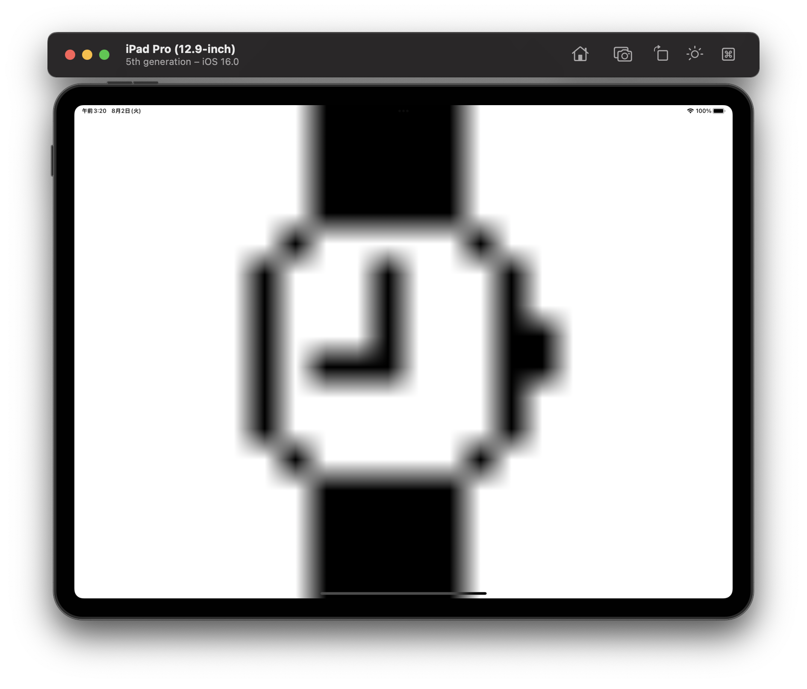
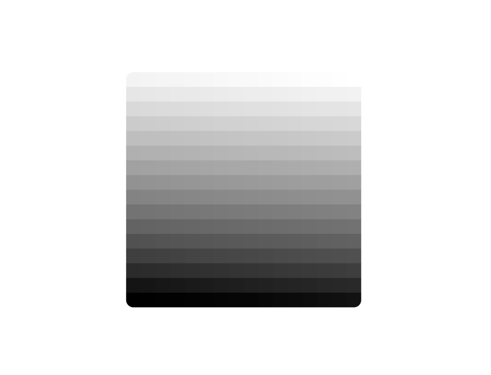
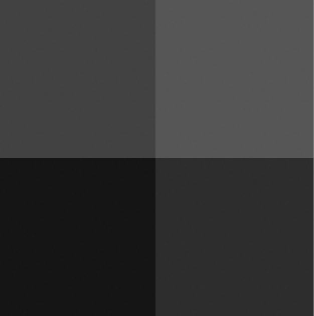
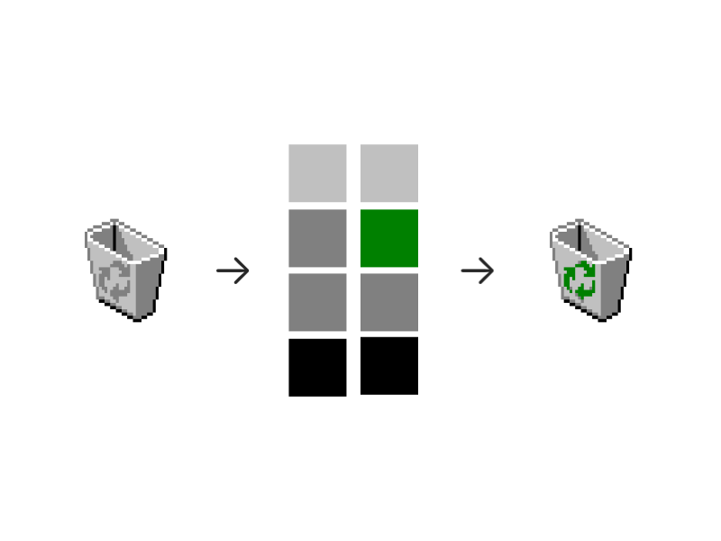

slidenumbers: true

# CoreGraphicsでドット絵を描こう
## Track C レギュラートーク（20分）

---

# noppe


- 株式会社ディー・エヌ・エー
    - Pococha
- 個人アプリ開発者
    - vear
    - **Editormode**
- iOSDC18~21 登壇
- きつねが好き

^ こんにちは、noppeです。株式会社ディー・エヌ・エーでソーシャルライブアプリPocochaのiOSアプリエンジニアをしています。
^ また、個人ではvearというバーチャル自撮りアプリや、今日お話しするEditormodeというドット絵向けのデジタルイラストレーションアプリを開発しています。
^ 今回でiOSDC４年目の登壇になります。よろしくお願いします。

---


^ TODO: Editormodeとは何か
^ EditormodeはCoreGraphicsとUIKitで作られています。
^ デジタルイラストレーションのアプリは、一般的にメモリ上にキャンバスのデータを展開し、それを編集する作業を繰り返します。
^ CoreGraphicsは、画像データをメモリに展開・編集するAPIを提供しています。iOS2.0から存在する歴史の長いフレームワークですが一方で当初から非常にシンプルで使いやすいインターフェイスが提供されています。
^ 今日はこのようなドット絵を描くためのアプリを、CoreGraphicsのAPIでどのように実現しているのかを紹介します。

---

# Agenda

1. ドット絵エディタとは
2. シンプルなドット絵エディタを作る
3. CoreGraphicsの拡張
4. パフォーマンスの改善

^ まずは、ドット絵についての歴史やトレンドを確認してこれから扱うドット絵エディタとはどんなものなのかを理解します。
^ 続いて、実際にCoreGraphicsとUIKitを使ってシンプルなドット絵エディタを開発して、ワークフローやCoreGraphicsのベーシックな使い方を説明します。
^ その後、CoreGraphicsに存在しないAPIやよりドット絵を扱うアプリとしての完成度を上げるための方法を学びます。
^ 最後にMetalやCoreImageを使って、ドット絵アプリのパフォーマンスを向上させるコツについてお話しします。
^ それでは、ドット絵エディタについて見ていきましょう

---

# ドット絵エディタとは


^ 最近ドット絵が話題になった例として、今年のWWDCがあります。

---


^ 今年はデジタルラウンジでモノクロームピクセルアートチャレンジが開催されて、現代のアプリアイコンを白と黒の２色のアイコンに描き直すというチャレンジが開催されました。
^ 実際に私もEditormodeを使って参加しました。右上のマップアイコンがそれですね。
^ これらの作品はWWDCのデイリーダイジェストで見ることが出来ます。
^ これらの作品を観察すると分かるとおり、薄い色を白と黒のチェック模様で再現したり、重要で無い要素を省いたりと、有限なリソースの中で最大限表現するための工夫が散りばめられています。
^ こういったいくつかのドット絵の工夫をツールとして提供することも、ドット絵専用アプリの価値と言えるでしょう。

---


^ またドット絵は、このように小さな解像度の中で絵を描く表現方法です。
^ 描画に割けるメモリが小さいコンピューターやおもちゃのような解像度の小さいゲーム機などで使われていました。

---


<!-- https://oldwindowsicons.tumblr.com/tagged/windows%2098 -->

^ デバイスの進化とともに、ドット絵は使われる色が増えたり、解像度が増して細かくなっていきます。

---


^ 現代で使われる画像のほとんどはベクターや写真といった画像が一般的になり、手作業で描かれたドット絵はアートの側面で使われることが多くなりました。
^ このように、ドット絵は地続きに姿を変えたこともあり、どれほど小さければドット絵なのか、色が少ないならドット絵なのか、定義が難しい表現方法でもあります。
^ しかし、解像度の制約の強い環境ほど、自然にドット絵らしく見えるので、ドット絵を扱うアプリは、この制約を再実装して再現することでドット絵であることに説得力を持たせようとします。
^ Editormodeのようなドット絵エディタの意義とは、こういった制約を付けた環境をユーザーに提供して、自然にドット絵をかけるような環境を用意することにあるとも考えられます。
^ では、実際にiPadにドット絵を表示して本来の解像度よりも低い解像度のように表示してみましょう。

---

## ドット絵を表示する

```swift
imageView.contentMode = .center
imageView.image = UIImage(named: "watch")
```


^ これは、UIImageViewを使ってiPadに16x16のドット絵を等倍で表示した状態です。
^ 現代のディスプレイは非常に高解像度なのでドット絵は見えないほど小さく表示されます。

---

## ドット絵を表示する

```swift
imageView.contentMode = .scaleAspectFit
imageView.image = UIImage(named: "watch")
```



^ 次にUIImageViewのcontentModeをscaleAspectFitにして、画面いっぱいに表示してみます。
^ これで時計のアイコンが映っていることは分かりましたが、ぼやけてしまっています。
^ UIViewにはこのように、小さい画像を拡大する際にスムーズに補完する機能がデフォルトで設定されています。

---

## ドット絵を表示する

```swift
// Use nearest magnificationFilter
imageView.contentMode = .scaleAspectFit
imageView.layer.magnificationFilter = .nearest
imageView.image = UIImage(named: "watch")
```

```swift
// SwiftUI
Image(...).interpolation(.none)
```

-　画像自体のリサイズは重くメモリを浪費するのでNG


^ 拡大時の補完のアルゴリズムはlayerのmagnificationFilterが担っており、これをnearestにすることでドット絵をクッキリと描画することができます。
^ SwiftUIではinterpolationをnoneにすることで同じ結果を得ることができます。
^ このように表示目的で拡大する際も、普通のアプリと同じようにUIImageViewやSwiftUIを利用します。
^ 注意点として拡大するために、実際のイメージをリサイズすることは避けましょう。
^ リサイズは非常に時間がかかる上に、大量のメモリを消費します。

---

# シンプルなドット絵エディタを作る

---


^ では、シンプルなアプリの開発に移りましょう。
^ ドット絵エディタは、ただ描画するだけでは成り立ちません。
^ タップした位置を塗りつぶすといった編集の機能も必要になります。

---


^ これらの一連の流れは非常にシンプルで、タップした位置を塗りつぶし、それを表示する繰り返しです。
^ この処理をCoreGraphicsとUIKitで実現するには、CGContextとUIImageViewとUITapGestureRecognizerを使います。
^ CGContextとは、絵を描くためのキャンバスのようなもので、このクラスに塗りつぶす領域を渡すことで塗りつぶしたり、イメージとして取り出すことが出来ます。

---

## ドット絵エディタのワークフロー

[.code-highlight: all]
[.code-highlight: 5]
[.code-highlight: 6]
[.code-highlight: 7]
[.code-highlight: 8]
[.code-highlight: all]

```swift
let imageView = UIImageView()
let context = CGContext()

func setup() {
	imageView.onTap = { point in // 1
		context.fill(point) // 2
        let image =  context.makeImage() // 3
		imageView.image = image // 4
	}
}
```


^ 疑似的なUIKitのコードにするとこのようになります。
^ ImageViewがタップされると
^ contextにタップした位置のピクセルを塗りつぶすことを要求します。
^ 最後にcontextから画像を取り出してImageViewにセットして描画します。
^ 非常にシンプルですね。
^ それでは省略している部分を詳しく説明していきます。

---

## グレースケールのCGContextの初期化

[.code-highlight: all]
[.code-highlight: 3]
[.code-highlight: 4-5]

```swift
// グレースケール専用のCGContextを生成
let context = CGContext(
    data: nil,
    width: 16,
    height: 16,
    bitsPerComponent: 8,
    bytesPerRow: 1 * 16,
    space: CGColorSpaceCreateDeviceGray(),
    bitmapInfo: CGImageAlphaInfo.none.rawValue
)
```

^ CGContextは実際にはこのようなイニシャライザを使って生成しています。
^ このコードは、白黒の濃淡だけが使えるグレースケースのCGContextを作るコードになっています。
^ 引数が多くて複雑に見えますが、実は簡単なので１つづつ見てみましょう。
^ 第一引数のdataは、CGContextが扱う画像のメモリ領域です。nilを与えると他のパラメータを元に自動で領域を確保します。画像のデータを渡すことで最初から書き込まれたCGContextを作ることもできます。
^ width, heightは画像のサイズです。

---

## bitsPerComponent

- 1色を分解した時の1コンポーネントあたりのビット数

例

- フルカラー = 4コンポーネント（Red,Green,Blue,Alpha）
- グレー = 1コンポーネント（Gray）
- 256階調 = 8ビット

^ bitsPerComponentは、1色を分解した時の1コンポーネントあたりのビット数を指定します。
^ 例えばフルカラーならRGBAの４つのコンポーネントを、グレーならグレースケールの１つのコンポーネントを持っています。
^ 今回は256階調のグレースケールにするので、8ビットを指定します。

---

## bytesPerRow

- 画像の横一列が何バイトになるか

例

- 8 Bit = 1Byte
- フルカラー64x64 = 1Byte x 4Component x 64pixels = 256
- グレー16x16 = 1Byte x 1Component x 16 = 16

^ bytesPerRowは、画像の横一列が何バイトになるのかを指定します。
^ 今回は１ピクセルが１バイトになるので、横のピクセル分16をかけて、1x16で16を指定します。

---

## space

- カラースペース

例

- `CGColorSpaceCreateDeviceRGB()`
- `CGColorSpaceCreateDeviceGray()`


^ spaceは色空間の指定です。今回はグレースケールなのでCGColorSpaceCreateDeviceGrayを指定します。

---

## bitmapInfo

- アルファチャンネルの場所 | バイトオーダー | フォーマット　のビットマスク

例

- CGImageAlphaInfo.noneSkipLast.rawValue | CGImageByteOrderInfo.order32Little.rawValue | CGImagePixelFormatInfo.packed.rawValue
- CGImageAlphaInfo.none.rawValue

^ bitmapInfoには、アルファの位置やバイトオーダーなどを指定します。今回は透過度は無いのでnoneを指定します。

---



^ これで256色の色が使えるCGContextを作ることができました。
^ フルカラーのCGContextが使いたい場合は、次のように指定します。

---

## フルカラーのCGContextの初期化

```swift
let context = CGContext(
    data: nil,
    width: 16,
    height: 16,
    bitsPerComponent: 8,
    bytesPerRow: 4 * 16,
    space: CGColorSpaceCreateDeviceRGB(),
    bitmapInfo: CGImageAlphaInfo.noneSkipLast.rawValue
)
```

^ フルカラーの場合、４つのコンポーネントで構成されるのでbytesPerRowは4 * 16で64を指定します。
^ 色空間もRGBを指定します。
^ bitmapInfoは、不透明度が無い場合はskipLastを指定して４つ目のコンポーネントを無視するようにします。

---


^ これでフルカラーのCGContextを作ることが出来ました。

---

## contextの画像を描画する

```swift
let cgImage: CGImage = context.makeImage()!
let uiImage: UIImage = UIImage(
    cgImage: cgImage,
    scale: 1,
    orientation: .downMirrored
)

// UIKit
imageView.image = uiImage
// SwiftUI
Image(uiImage: uiImage)
```

^ 作ったcontextが持つ画像を描画するには、makeImage関数によって生成されたCGImageを経由します。
^ CGImageは実際のメモリ上の画像を参照するイメージクラスです。
^ そして、普段意識することはありませんが、UIImageはCGImageを始めとした様々な画像データをそのデータ構造を意識せずに使えるようにしたラッパークラスです。
^ UIImageは今回のように既にメモリ上に展開された画像を扱うこともあれば、ベクターデータを受け取って内部で展開することもあります。
^ UIImageにさえ出来てしまえば、UIImageViewやSwiftUIで簡単に描画することができます。

---

## タップ位置 → ドット絵の座標への変換

```swift
let imageSize = CGSize(width: 16, height: 16)
let targetView = tapGesture.view!
// ビューのタップ位置を取得
let location = tapGesture.location(in: targetView)
// 👍 UIImageViewとドット絵のアス比は揃えておくと計算しやすい
let x = Int(location.x * (imageSize.width / targetView.bounds.width))
let y = Int(location.y * (imageSize.height / targetView.bounds.height))
let point = CGPoint(x: x, y: y)
```

^ 画面上のタップ位置はUIGestureRecognizerのlocationInViewから得ることが出来ます。
^ それがドット絵上のどのポイントを指しているかを計算しやすくするために、UIImageViewのサイズは描画する画像と同じアスペクト比にしておくと良いでしょう。

---

# 色の塗りつぶし

```swift
let color = CGColor(gray: 0, alpha: 1)
context.setFillColor(color)
let rect = CGRect(origin: point, size: CGSize(width: 1, height: 1))
context.addRect(rect) // Pathの追加
context.fillPath()
```

```swift
// 他にも...
context.addArc(...) // 円
context.addEllipse(in: CGRect) //楕円
context.addLines(between: [CGPoint]) //線
context.path = UIBezierPath(...).cgPath //任意のパス
```

^ 最後にcontextで色を塗る処理を紹介します。
^ contextのsetFillColorを呼ぶと、それ以後の塗りつぶし色が指定した色になります。
^ 次に塗りつぶすパスを指定します。今回は1ドットを塗り潰したいのでaddRectで1x1の矩形を指定しました。
^ 最後にcontextのfillPathメソッドを呼ぶと、contextに追加されたpathが塗りつぶされます。
^ これでドット絵を描くアプリを作ることが出来ました。
^ それでは、次はこのアプリの完成度を上げていきましょう。

---

# CoreGraphicsの拡張

---


^ 先ほど作ったアプリの続きです
^ UIPanGestureRecognizerと楕円のパスを使って、楕円を描画する機能を追加してみました。

---


^ しかし、実行してみると違和感があることに気が付きます。
^ 円の縁に小さなドットが描画されてしまうのです。

---


^ Editormodeの円ツールと見比べると違和感が分かりやすいです。
^ CGContextで線を書く場合、アンチエイリアスを無効化しますが、それをするとこのように小さい図形は不恰好になってしまいます。
^ これを防ぐには、独自に描画関数を実装する必要があります。

---

## CGContextに自作関数を生やす

```swift
extension CGContext {
    func fillEllipseLine(in rect: CGRect) {
        // 塗りつぶすパスを作る
		let path = makeEllipsePath(in: rect)
        // パスを追加
        addPath(path)
        // 追加したパスを塗りつぶす
        fillPath()
    }
}
```

^ CGContextの描画関数を自作するには、先ほどの矩形と同じように塗り潰すパスを作り、addPathで追加しfillPathを呼んで塗り潰すだけです。
^ パスさえ作れてしまえば、どんな形状でも塗り潰すことが出来ます。

---

## Bresenham's line algorithm[^2]

- 1962年、IBMのジャック・ブレゼンハムが開発
- 直線から最短距離にある画素を並べる
- 円を描画する発展系のアルゴリズムがある
- noppefoxwolf/swift-line-algorithms


[^2]: https://ja.wikipedia.org/wiki/ブレゼンハムのアルゴリズム

^ 肝心の塗りつぶすパスの求め方ですが、ブレゼンハムの線分描画アルゴリズムを使うことで得ることが出来ます。
^ このアルゴリズムはコンピュータの最初期に生まれたもので、多くの低解像度なモニターで使われてきた実績のあるアルゴリズムです。
^ 基本は線を描くアルゴリズムですが、円や曲線を描くために発展させたものもありそれらを利用することで楕円を描くことが出来ます。
^ Swiftでの実装はnoppefoxwolf/swift-line-algorithmsを確認してみてください。

---

# CoreGraphicsの拡張2

---

## バケツツール

- 閉じられた範囲内を塗りつぶす機能
- Flood Fillというアルゴリズム
- 選択した色を同じ色かどうかを探しながら色を置き換えていく
    → CGContextから色を取得する必要がある


^ 続いて、閉じられた範囲内を塗り潰すバケツ機能を作ってみましょう。
^ フラッドフィルと呼ばれるアルゴリズムを使って自作の関数を作る必要があります。
^ このアルゴリズムは選択した位置にある色と同じ色を探しながら処理するため、CGContextから特定の座標の色を取得する必要があります。

---

## CGContextから色を取り出す

- 特定の座標の色を取得するAPIはない
- self.dataからメモリに直接アクセスできる
- メモリレイアウトを確認して、取り出す

^ CGContextから色を取り出すAPIは生えていませんが、メモリのポインタをdataというプロパティから取得できます
^ これを使って色を取り出すAPIを自作していきます。
^ 色を取り出す前に、CGContextの内部でどのように画像が配置されているかを見てみましょう。

---

## メモリレイアウトを確認する

2x2のCGContextを

- 17.0 / 255.0 (0x11)　左下
- 34.0 / 255.0 (0x22)　右下
- 51.0 / 255.0 (0x33)　左上
- 68.0 / 255.0 (0x44)　右上

のグレー値４色で着色



^ まず、2x2のCGContextに４色のグレーを付けます。
^ 分かりやすいように、色はそれぞれ１６進数で11,22,33,44となる色をつけます

---

## メモリレイアウトを確認する

lldbでdataのアドレスを確認します

```swift
// Swift Code
let ctxData = context.data
```

```
// LLDB
(lldb) frame var -L ctxData
0x000000016d5379e8: (UnsafeMutableRawPointer) ctxData = 0x600000c51670
```

**0x600000c51670**がCGContextのdataが格納されているアドレス

^ 次にlldbでCGContextのdataが格納されているメモリのアドレスを確認します。

---

## メモリレイアウトを確認する

- Debug > Debug Workflow > View Memory
- メモリアドレスを入力する


^ そして、Debug > Debug Workflow > View Memoryからメモリビューアを開くと、メモリ内をビューアで見ることが出来ます。

---

## グレースケールのメモリレイアウト

- 左下から右上にかけて順番に配置されている
- 1ドット1byteで4ドット分並んでいる


^ 参照すると次のように色が並んでいることがわかります。
^ つまり、シンプルに左下から右上にかけての色が格納されていることが分かりました。

---

## フルカラーのメモリレイアウト

- RGBAの順番で配置
- 1ドット4byteで4ドット分並んでいる


^ フルカラーの場合も同様に、RGBAの値が並んでいます。

---

## CGContextのdataから色を取り出す

```swift
// CGContextがフルカラーの場合
struct RGBAColor {
  let r, g, b, a: UInt8
}
/// ポインタから先頭32bitをRGBAColorとして取り出す
let color = data.load(as: RGBAColor.self)
```

^ メモリレイアウトの通りにstructを作ることで、load関数を使ってポインタから型を指定して値を取り出すことが出来ます。
^ load関数はoffsetを指定することもできるので、２ピクセル以降はoffsetを使ってポインタを合わせます。

---

## 塗り潰し

- キャンバスサイズや塗りつぶし範囲の複雑さによって時間がかかる
- 最適なアルゴリズムの選定
- メモリを直接・書き込みして高速化
    → Swiftなら型安全にできる

^ ドット絵は解像度の低い画像ですが、フラッドフィルのような処理は反復して多くのfor-loopを行う可能性があります。
^ 処理を短時間で終わらせるためには、このようにメモリを直接参照したり余分な計算を減らす必要があります。
^ Swiftの型のおかげで複雑なコードを書かずにポインタを触ることが出来ました。
^ 最後にドット絵のパフォーマンスを向上させるための工夫を見てみましょう。

---

# パフォーマンスの改善

---

## 消費メモリを削減する

- ドット絵は色数が少ないことを利用する

^ ドット絵は一般的に全体で使用する色数が少なくなります。
^ この特徴を利用して、メモリ上の画像サイズを減らす工夫をしてみます。

---

## インデックスカラー

1. 画像を256色のグレースケールで編集する
2. 256色のグレーの色それぞれにフルカラーの色を対応させたインデックスを用意する
3. インデックスを元に描画

- キャンバスのメモリ確保が1/4程度で済む
- レトロゲームの2Pカラーの仕組み




^ 今回はインデックスカラーという手法を利用します。
^ まず、グレースケールで画像を保持します。
^ グレースケールは256階調のグレーが使えますが、このグレー１つ１つにフルカラーの色、256色を対応させたインデックスを作ります。
^ フルカラーは1600万色ほどありますが、実際に使う色に絞れば現実的でしょう。
^ レンダリングのタイミングでこの色を対応表通りに戻してあげることでディスプレイに表示されるタイミングでは色がついて見えるようになります。
^ キャンバスが確保するメモリはグレースケールなので、フルカラーの1/4にすることが出来ます。
^ 昔のゲームの2Pカラーなどがこの仕組みを使って、１つのキャラクターデータで複数の色のキャラクターを作っています。

---

## インデックスカラーの実装

- CGContextには機能として存在しないので自作
- 自前のCIFilter (CoreImage)を使って描画の直前で着色する
- CIFilterのシェーダはMetalで実装


^ 残念ながらCGContextにはインデックスカラーの機能が無いため、これも自前で実装することになります。
^ グレースケールのCGImageを取り出してをCIFilterにかけて着色します。
^ 着色した画像をCIFilterから取り出して、UIImageViewに表示すれば完成です。

---

## インデックスカラーフィルタの実装

```cpp
float4 lookupTable(sampler src, sampler lut) {
    float2 pos = src.coord();
    float4 pixelColor = src.sample(pos);
    int index = pixelColor.r * 255;
    int x = index % int(lut.size().x);
    int y = index / int(lut.size().y);
    float2 lutPos = float2(x, y);
    float4 lutColor = lut.sample(lutPos);
    return lutColor;
}
```

- noppefoxwolf/PixelArtKit

^ インデックスカラーフィルタはMetalを使ってシェーダを実装します。
^ 少し難しそうに見えますが、グレースケールの値をindexの位置に変換して色を取り出しています。
^ 詳しい実装に関しては、noppefoxwolf/PixelArtKitで公開しているのでご覧ください。

---

# Recap

1. ドット絵エディタはCoreGraphicsとUIKit(SwiftUI)で実装できる
- CGContextはCGPathを使えば自由な描画関数を実装できる
- CGContextはメモリを直接参照できる
- ブレゼンハムやインデックスカラーなどの知見は今も活かせる

^ 長くなりましたが、以上になります。
^ 今回のトークを短く振り返ります。
^ ドット絵エディタはCoreGraphicsとUIKit(SwiftUI)で実装できる
^ CGContextはCGPathを使えば自由な描画関数を実装できる
^ CGContextはメモリを直接参照できる
^ そして、インデックスカラーやブレゼンハムなど、ドット絵の現役の工夫は今も活かすことが出来ます。
^ みなさんもドット絵エディタを作る際はぜひ参考にしてみてください！
^ 以上になります。
