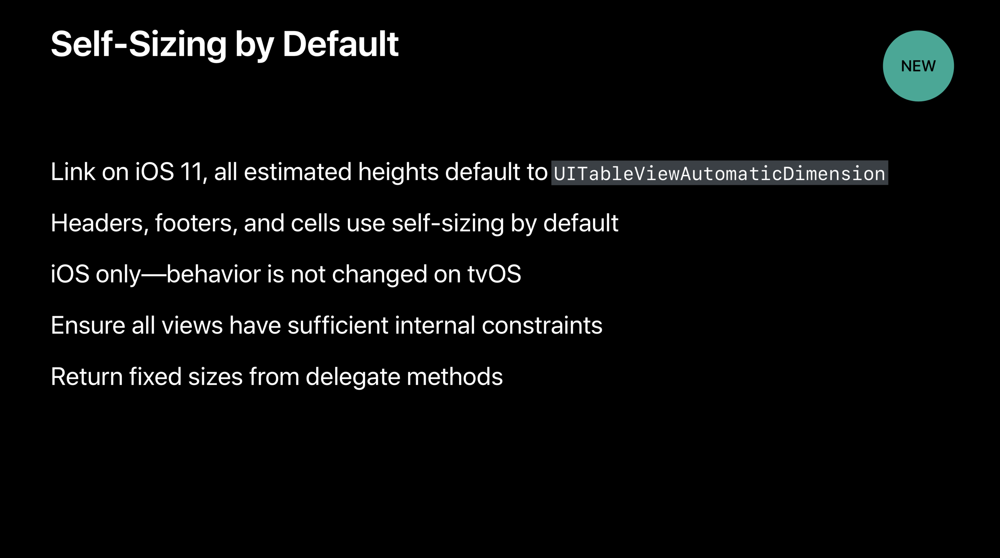

footer: 🦊 @noppefoxwolf, 2018
slidenumbers: true

# [fit] Self Sizing

---

# noppe
@noppefoxwolf

iOSアプリ開発者
８年目

🦊が好きです！


---

iOS11からUITableViewCellの高さを自動計算するようになりましたね[^1]

[^1]: https://developer.apple.com/videos/play/wwdc2017/204/

---



---

iOS10では以下のようなような記述をすれば同様の事が可能でした

```swift
tableView.estimatedRowHeight = 125.0
tableView.rowHeight = UITableViewAutomaticDimension
```

---

UITableViewAutomaticDimensionを使うと、AutoLayoutを利用して高さを自動計算してくれます。[^2] [^3]

[^2]: https://developer.apple.com/library/content/documentation/UserExperience/Conceptual/AutolayoutPG/WorkingwithSelf-SizingTableViewCells.html

[^3]: マニュアルレイアウトの時は計算してくれない。

---

# [fit] どうやって高さを参照している？

---

# どうやって高さを参照している？

UIViewControllerの`preferredContentSize`のようにCocoa系では、ビュー自身が推奨のサイズを返す実装が一般的。
つまり、UITableViewCell側に高さを返すメソッドがあるのでは…？

---

UITableViewCellのサブクラスで以下のメソッドの返り値を異常な値にして自動で計算された値が壊れるか検証

```swift
1.intrinsicContentSize

2.systemLayoutSizeFitting(_ targetSize:)

3.systemLayoutSizeFitting(_ targetSize:,
                        withHorizontalFittingPriority:,
                        verticalFittingPriority:)
```

---

UITableViewCellのサブクラスで以下のメソッドの返り値を異常な値にして自動で計算された値が壊れるか検証

```swift
3.systemLayoutSizeFitting(_ targetSize:,
                        withHorizontalFittingPriority:,
                        verticalFittingPriority:)
```

から返される値を参照している事が判明

---

```swift
func systemLayoutSizeFitting(_ targetSize:,
                        withHorizontalFittingPriority:,
                        verticalFittingPriority:)
```

制約と指定されたフィッティングの優先順位に基づいてビューの最適なサイズを返すメソッド。[^4]

[^4]: https://developer.apple.com/documentation/uikit/uiview/1622623-systemlayoutsizefitting

---

仕組み

```
(lldb) po targetSize
▿ (414.0, 0.0)
  - width : 414.0
  - height : 0.0

(lldb) po horizontalFittingPriority
▿ UILayoutPriority
  - rawValue : 1000.0
-> UILayoutPriority.required

(lldb) po verticalFittingPriority
▿ UILayoutPriority
  - rawValue : 50.0
-> UILayoutPriority.fittingSizeLevel
```

縦方向の制約は通常は50以上の制約なので高さが決まる。

^とばす

---

# [fit] ここからが本題

---

- ところで、この最小サイズを返してくれる`systemLayoutSizeFitting`は何かに使えないでしょうか…？

- ビューには固有サイズを返す`intrinsicContentSize`というものが生えています。

```
var intrinsicContentSize: CGSize { get } 
```

---

つまり…

`intrinsicContentSize`と`systemLayoutSizeFitting`を組み合わせることで
Self-Sizing可能なカスタムビューを簡単に作ることができる！

---

<!-- ここではルールとしてcontentViewの一番上は必ずStackViewを載せることとします。
そして、StackViewの上で自由に配置します。
??
//StackViewはfillであればsystemLayoutSizeFitting(UILayout~)は最小のサイズを返します。

intrinsicContentSizeの中でsystemLayoutSizeFittingを呼びます。
あとはビュー生成時にXIBと紐付ける実装をします

Storyboardに載せる際はintrinsic content sizeが存在するので適当にplaceholderをセットします。 -->

一般的なCustomViewの実装でもSelf-Sizing出来る

---

UItableviewのパフォーマンス

iOS10でも

---
OSSにしました。

pros/cons

以上です！
