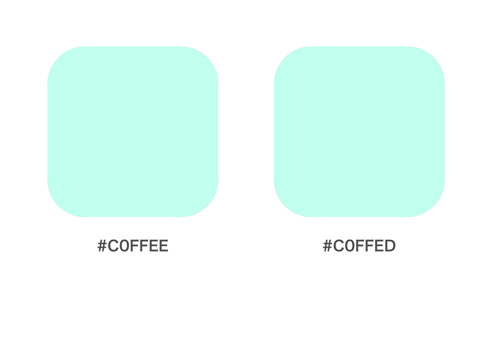
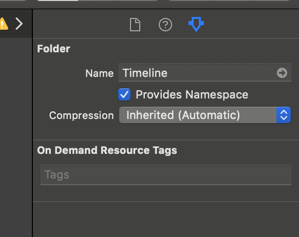

# アプリにおけるアセットの管理

## Pocochaの事例

---

#[fit] noppe

🏢 株式会社ディー・エヌ・エー
🦊 きつねかわいい
💻 アプリ開発２０１０〜

---

# Pocochaの紹介

---
[.autoscale: true]

# アセットの例

- 画像
- 色
- 効果音
- Storyboard
- フォント
- 動画

---

# アセットの特徴

- 視聴覚に頼ることで個々を認識出来る

---

// TODO
hex -> asset

---

// TODO
ビューアの存在
^ このように人間はアセットを管理していた

---

# Xcodeでの管理

xcassetsを使う

- アプリ開発でよく使う形式のプレビューに対応
- コード中にプレビューを表示して呼び出す事も出来る
    - Color Literal / Image Literal

---

# Color Literal / Image Literal

---

# アセット管理の問題点

- 視聴覚は信頼できない

---

---

# アセット管理の問題点

プロジェクトの規模が大きくなるほど、類似のアセットが増える。
- 解像度の違う画像アセット
- 近似色のカラーアセット

---

# 類似のアセットの可読性を上げる

結局は名前を付けて呼び出す事がベスト
見た目＋特徴の組み合わせで、アセットを特定出来るような名前を付ける

`TriangleRed`
`TriangleLarge`

`Back`などの動作名はアセットの見た目が分からないのでNG
//TODO Shareとかどうするんや

---

# 重複する名称の対策

画面が異なり、アセットも異なるが、見た目が似ているアセットがある可能性は事前に考慮しておく

`UserProfileView/TriangleLarge`
`ProfileEditView/TriangleLarge`

---

# 共通で使われるアセット

複数のビューで利用されるアセットは、`Common`などのネームスペースを切っておく

`Common/LeftArrow`

---

# ネームスペースを活用する

ビューのツリー構造に似た名称になっていくため、ネームスペースを活用する
xcassetsのネームスペースを有効にする事で重複したファイル名を利用できる。

`ProfileEdit/Triangle/Large`

---

# ネームスペースを活用する

---

# ネームスペースを活用する

`let image = UIImage(named: "News/Share")`

---

# XCAssetsとは

画像とjsonを内包するディレクトリ
更に管理しておくと最適化の恩恵も受けれる

# XCAssetsを呼び出す

文字列だと微妙
SwiftGen

# XIB/Storyboard

画像は指定しない、コンパイル時に分からなくなる
画像を使ってUIImageViewのサイズを指定したい時はintrinsicContentsize
Inabaで見つけられる

# 構造と命名

見た目の名前をつける
NameSpaceを切ったほうがいい

# ラスタライズ
pdfからラスタライズ
ランタイムでもラスタライズできる

# アプリのアイコン
なぜかpdfで作れない（要検証）
AppIconGenで作れる（重複処理も大丈夫）

# 差分のある画像
ランタイムで生成
