footer: 🦊
slidenumbers: true

# ScneKitでふんわりした影を作る

---
# noppe

---

# iOS12からusdzをサポート

usdz: AppleとPixerで共同開発した3Dファイルフォーマット

---

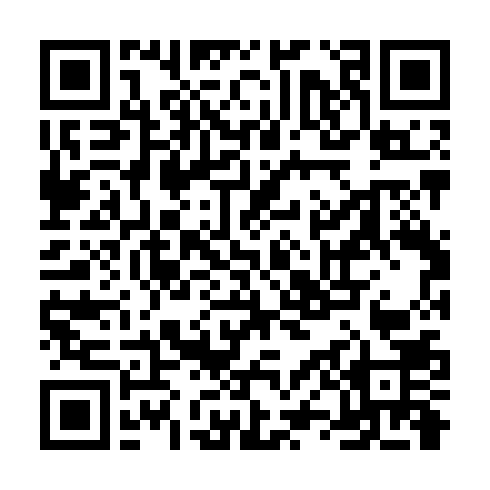

---

# FileでプレビューやAR配置も可能


---

# Fileのプレビューの影に注目⇨

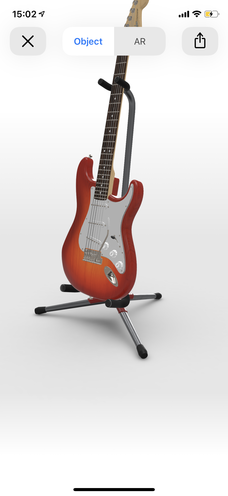

^ すごい綺麗

---

# WWDC2018でContact Shadowと表現[^1]

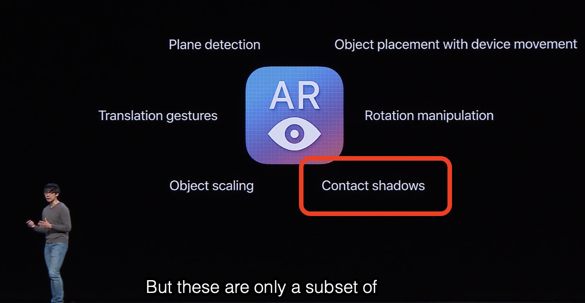

[^1]:https://developer.apple.com/videos/play/wwdc2018/603/?time=417

---

# Contact Shadow（接触影）とは

"接地感・重なり感を出すためのもの"

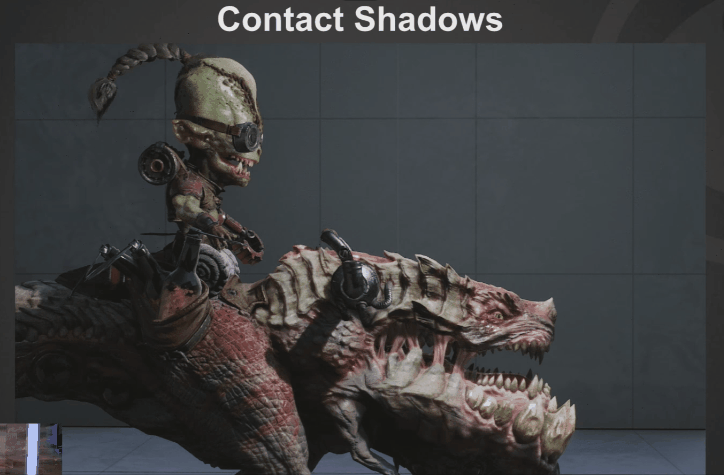

[^2]:https://twitter.com/unrealenginejp/status/800973173814480896

---

# Contact Shadow使ってみたい！

---

# SceneKitで影をつけてみる

- SCNLightのcastsShadowをONにする
- directionalか、spotタイプを使う[^3]

[^3]:https://developer.apple.com/documentation/scenekit/scnlight/1523816-castsshadow

---

```swift
// オブジェクト
let scene = SCNScene(named: "stratocaster.scn")!

// ライト
let light = SCNLight()
light.type = .directional
light.castsShadow = true
let lightNode = SCNNode()
lightNode.light = light

// 床
let floor = SCNFloor()
...
```

---

SCNLightでははっきりした影になってしまう。

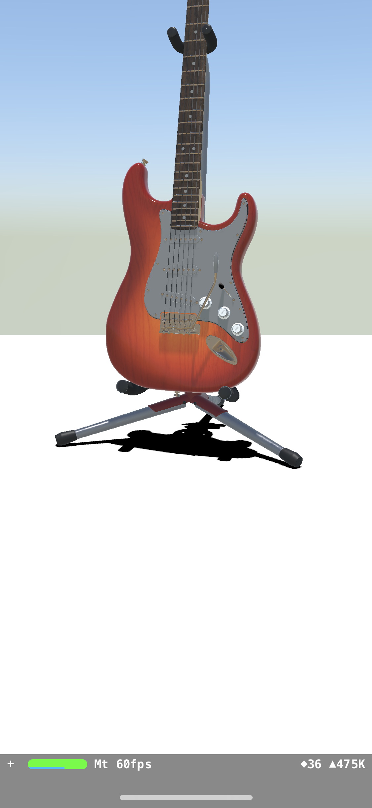

---

一応ShdaowRadiusもあるが、ボカし方が雑

```swift
lightNode.light!.shadowRadius = 16
lightNode.light!.shadowSampleCount = 16
```


---

ググっていると、ゲームの記事がヒット


[^5]:https://game.watch.impress.co.jp/docs/series/3dcg/538525.html

---

[.autoscale: true]

# screen-space ambient occlusion

物体が近接して狭くなったところや部屋の隅などに、周囲の光（環境光）が遮られることによって影が現れる現象をアンビエント・オクルージョン（環境遮蔽/環境閉塞、英: ambient occlusion）と呼ぶ。SSAOは3D画面のレンダリング結果に後処理をかけるポストエフェクトの一種であり、擬似的なレンダリング結果に追加するものである。[^4]

[^4]:https://ja.wikipedia.org/wiki/SSAO

---

# SSAO

```swift
camera?.screenSpaceAmbientOcclusionIntensity = 5
camera?.screenSpaceAmbientOcclusionNormalThreshold = 0.1
camera?.screenSpaceAmbientOcclusionDepthThreshold = 0.08
camera?.screenSpaceAmbientOcclusionBias = 0.33
camera?.screenSpaceAmbientOcclusionRadius = 3.0
```

---

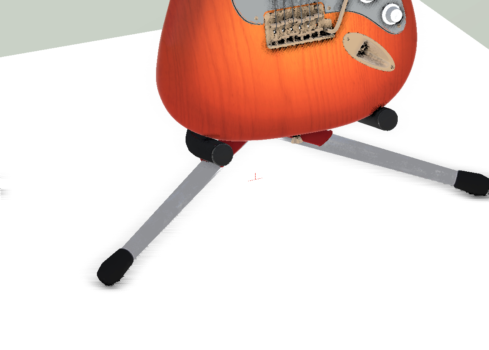

---

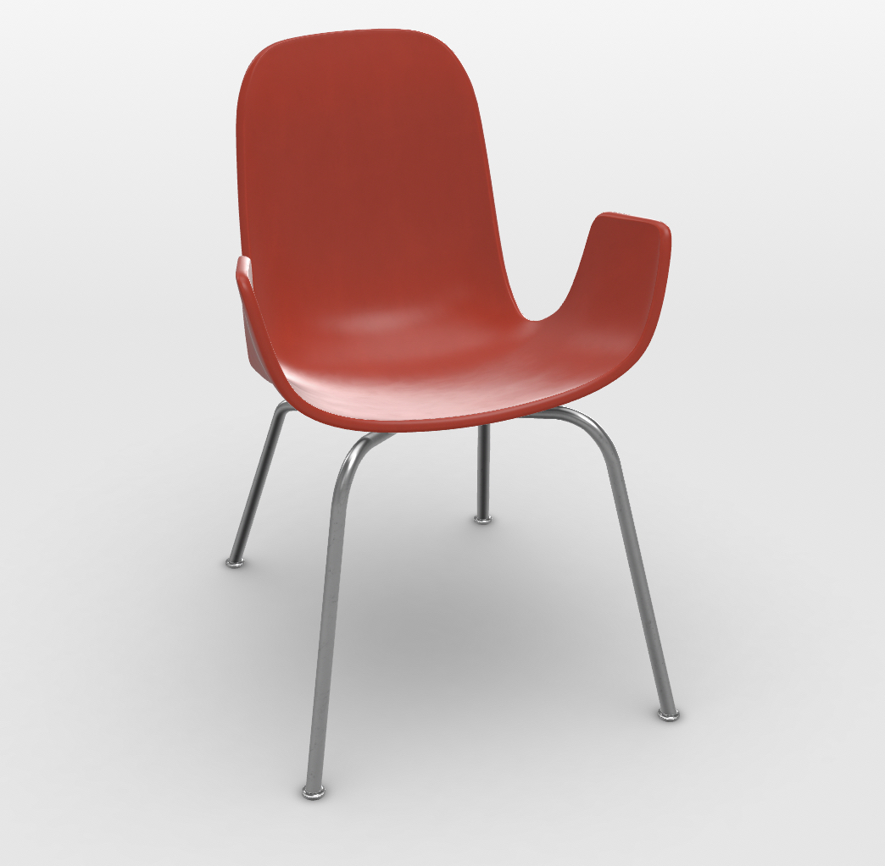

接地面以外の箇所の影もある

---

# ふんわりした影は自前で描画しないとダメそう

---

# SCNTechnique

- マルチパスレンダリングのためのクラス
画面１回の更新の間に、異なるシーンを複数回レンダリングして合成した結果を表示する機能。
MetalやOpenGLESでシェーダを書く事が出来る。
入力にシーンの色情報や深度情報が使える

---

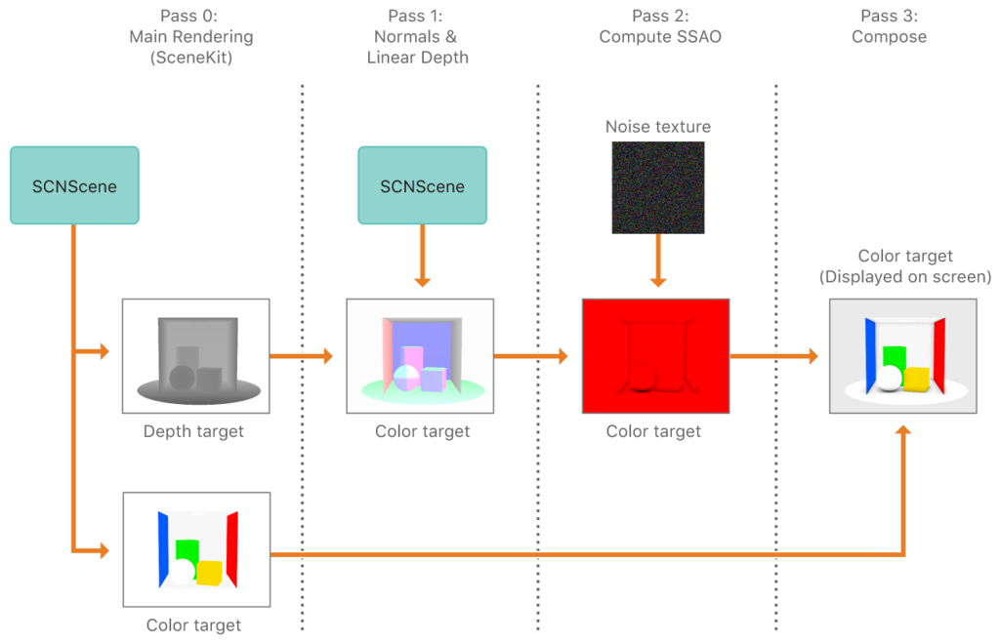

---

# やってみた

カメラを二つ配置して、下からの入力を深度に変換してブラーをかける。

---

[^5]

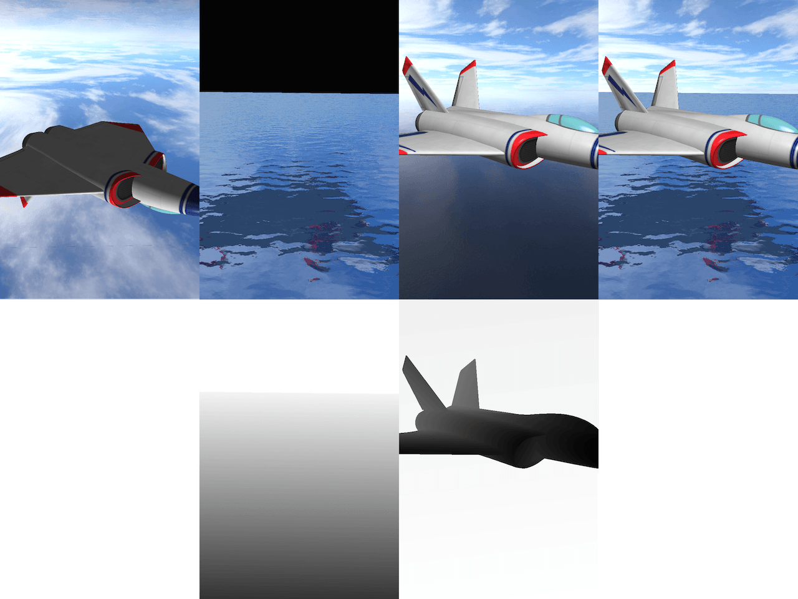

[^5]:http://blog.simonrodriguez.fr/articles/26-08-2015_a_few_scntechnique_examples.html

---

# 影だけ作ってみた

- よくみるとモアレ（縞模様）が…
- そもそもカメラ2台置くのは…
- シェーダ真面目に書こうとするとサクッと出来なそう

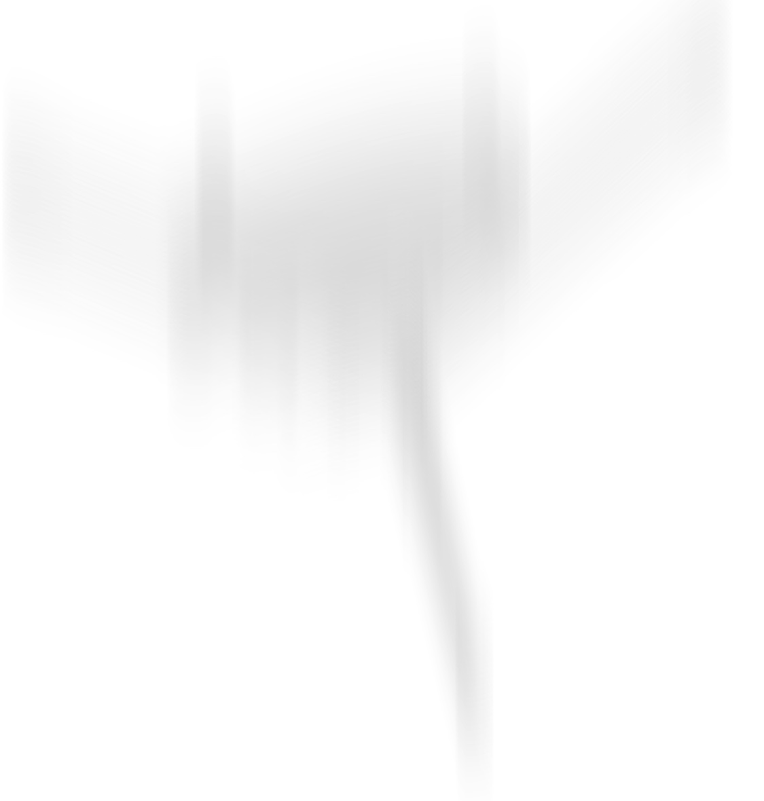

---

# 代替案を探す

---

# gobo

SCNLightの影を自前の画像で描画する機能

影を発射するライト

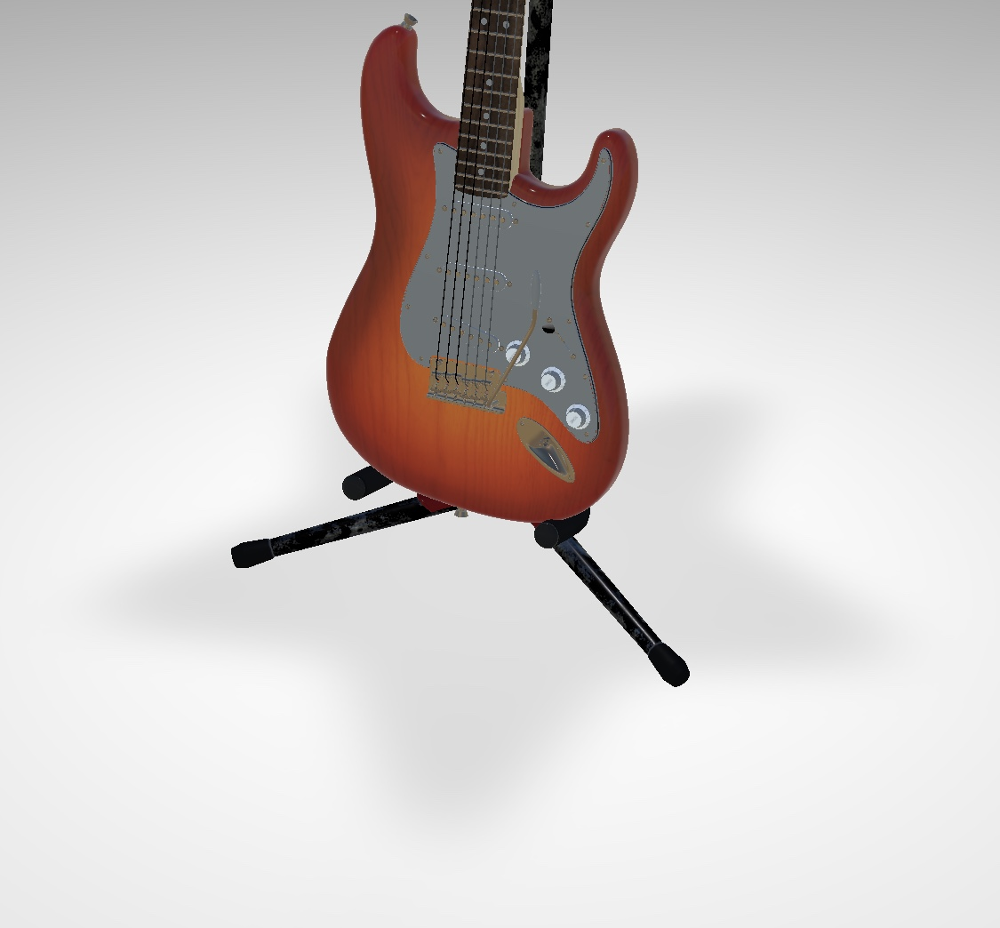

^ なんとか影を作って、goboにセットすれば良さそう

---

# gobo

- SCNTechniqueで深度画像に変換

- SCNViewのsnapshotでUIImageを取得

- CIFilterでブラーをかける

- SCNLightのgoboに画像をセット

---

# 結果

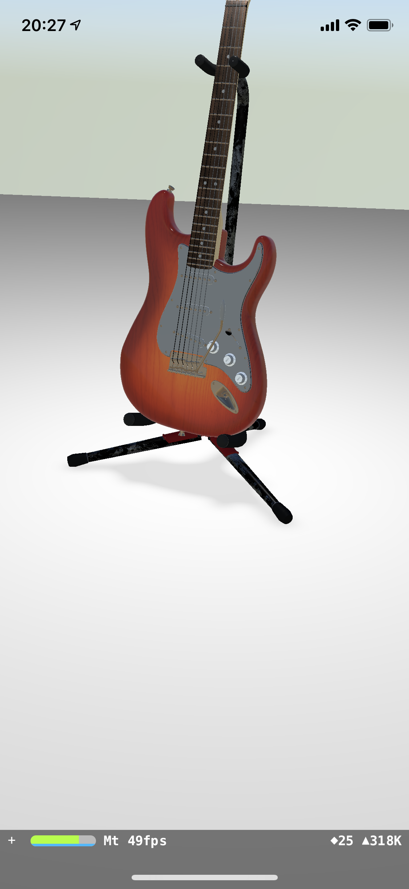

---

# 課題

- 影の濃淡などまだFileの表現に達していない

- SCNTechniqueで全て完結出来るかも

- shaderModifiersでライティングシェーダが弄れる


